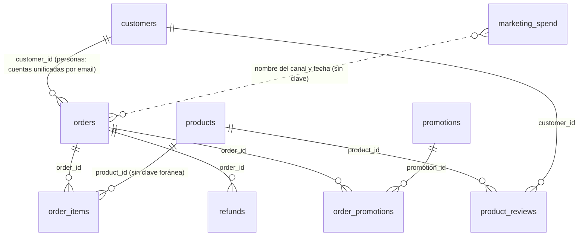

# Scuffers · Presupuesto de marketing para el segundo semestre

Análisis del **primer semestre de 2026** (del 1 de enero al 30 de junio) de una tienda online de moda, en un escenario ficticio, para decidir el presupuesto de marketing de H2. El README recoge las conclusiones, el modelo de datos y los supuestos del análisis.

- **Panel:** [business-case-scuffers.vercel.app](https://business-case-scuffers.vercel.app). Resumen da la visión general y Marketing, el detalle por canal en el que se apoya la propuesta de presupuesto.
- **Queries:** carpeta `sql/`, una por conclusión más las de apoyo ([índice](#anexo-c)). Las que alimentan el panel están en `sql/panel/`.

| Venta neta H1 | Pedidos | Ticket medio | Compradores | Devolución |
|:---:|:---:|:---:|:---:|:---:|
| **41.285 €** | 630 | 71,39 € | 125 personas | 9,6 % de los pedidos |

<a id="indice"></a>
## Índice

1. [Resumen](#resumen)
2. [Conclusiones](#conclusiones)
   - [A · Cuánto se vende](#bloque-a): [C1](#c1) · [C2](#c2)
   - [B · Quién compra y si vuelve](#bloque-b): [C3](#c3) · [C4](#c4)
   - [C · Qué canales merecen la inversión](#bloque-c): [C5](#c5) · [C6](#c6) · [C7](#c7)
   - [D · Qué productos funcionan](#bloque-d): [C8](#c8) · [C9](#c9) · [C10](#c10)
3. [Propuesta de presupuesto para H2](#plan)
4. [Modelado de datos](#modelado): [tablas y cruces](#cruces) · [reglas](#reglas) · [modelo común de las queries](#modelo-comun) · [problemas del dato](#problemas)
5. [Decisiones de presentación](#presentacion)
6. [Supuestos, limitaciones y decisiones revisadas](#supuestos): [supuestos](#tabla-supuestos) · [decisiones revisadas](#cambios) · [limitaciones](#limitaciones)
7. [Anexos](#anexos): [A · vistas del esquema](#anexo-a) · [B · notas de dirección ocultas](#anexo-b) · [C · índice de queries](#anexo-c) · [D · glosario](#anexo-d)

---

<a id="resumen"></a>
## 1. Resumen

> [!IMPORTANT]
> **La venta se mantiene, la captación no.** El semestre deja 41.285 € netos sin una tendencia clara, pero junio trae 10 clientes nuevos frente a 21,5 de media de febrero a mayo.
>
> **El presupuesto de marketing es pequeño y su reparto es mejorable.** H1 gastó 6.242 €, el 15,1 % de la venta neta, e Instagram gasta 725 € por cada cliente nuevo que capta.
>
> **Propuesta, a validar con marketing:** mantener el ritmo de gasto de marzo a junio (805 € al mes, 4.830 € para H2) y redistribuirlo de forma gradual: pausar Instagram como prueba, reforzar Google por tramos, orientar Meta hacia Alemania y no aumentar TikTok hasta poder medirlo mejor. Aun así, las palancas con más recorrido en H2 están fuera de este reparto: recuperar el tráfico orgánico y la recompra.

**Las cuatro preguntas de dirección**

| Pregunta | Respuesta | Base |
|---|---|---|
| 1 · ¿Cuánto hemos vendido y cómo ha evolucionado? | 41.285 € netos (6.881 € al mes) en 630 pedidos. La venta mensual oscila entre 5.068 € y 8.436 € sin una tendencia clara, mientras los clientes nuevos caen a la mitad en junio. | [C1](#c1) · [C2](#c2) |
| 2 · ¿Qué canales merecen más inversión y por qué? | Email y Google captan clientes a bajo coste (37 € y 74 €). Meta es más caro (201 €), pero capta sobre todo alemanes, que compran bastante más, y por eso rinde casi como Google. Instagram, con los datos actuales, no recupera lo que cuesta. TikTok no debería juzgarse por su venta atribuida. | [C5](#c5) · [C6](#c6) · [C7](#c7) |
| 3 · ¿Qué categorías y productos funcionan? | Ropa lidera. Deporte, contando Zapatillas Trail Urbanas, vende menos por referencia que el resto, y la mitad de su venta sale de fichas inactivas. La nota de las reseñas no anticipa la devolución y el ingreso por código está mal medido. | [C8](#c8) · [C9](#c9) · [C10](#c10) |
| 4 · ¿Qué haríamos distinto en H2, y con qué cifra? | Un reparto por canal planteado como piloto de dos meses, con un criterio de revisión por canal, un objetivo de unos 20 clientes nuevos al mes y un mensaje de segundo pedido. El detalle está en la [propuesta](#plan). | [Propuesta](#plan) |

**Las diez conclusiones**

| | Conclusión | Cifra clave | Qué se sugiere | Confianza |
|---|---|---|---|:---:|
| [**C1**](#c1) | La venta neta del semestre es de 41.285 € | 6.881 € al mes · 19 % menos que el subtotal | Presupuestar sobre la venta neta | Alta |
| [**C2**](#c2) | La venta no crece y la captación cae | 10 clientes nuevos en junio frente a 21,5 | Revisar Orgánico antes de mover presupuesto | Media |
| [**C3**](#c3) | Alemania hace la mitad de la venta con un 22,4 % de los compradores | 736 € frente a 213 € por comprador | Probar a captar más en Alemania | Alta |
| [**C4**](#c4) | Cada cohorte repite menos | 82,8 % → 47,1 % a 30 días | Probar un mensaje de segundo pedido | Media |
| [**C5**](#c5) | Email y Google captan barato. Meta es caro pero valioso. Instagram no compensa | 37 €, 74 €, 201 € y 725 € por cliente nuevo | Redistribuir de forma gradual | Media |
| [**C6**](#c6) | La venta atribuida por canal no refleja la captación | 18,4 % frente a 16,7 % al azar | Comparar canales por coste y valor del cliente nuevo | Alta |
| [**C7**](#c7) | El recorte de TikTok es real y su IEC engaña | 444 € por cada cliente nuevo de más | No aumentar TikTok por su IEC | Media |
| [**C8**](#c8) | Deporte vende menos por referencia que el resto | 486 € por referencia frente a 621–709 € | Aclarar sus fichas inactivas antes de apostar | Baja |
| [**C9**](#c9) | La nota de las reseñas no anticipa la devolución | Pantalón Cargo: 5,0★ y 14,3 % devuelto | Medir la calidad por devolución y motivo | Media |
| [**C10**](#c10) | El ingreso por código está inflado y los códigos no se controlan | +9,7 % · Bienvenida, 82 % en clientes que ya compraban | Registrar el descuento y limitar los códigos | Alta |

**Cómo leer las cifras.** Venta = subtotal de producto, sin IVA ni envío, de los pedidos válidos y no cancelados (entregados, pendientes y devueltos). Venta neta = venta − devoluciones. Pedido válido = no dado de baja y no de prueba. Persona = cliente con sus cuentas duplicadas unificadas. Confianza alta = cifra contable o diferencia grande y estable; media = tendencia clara con grupos de 5 a 30 clientes; baja = pocos casos o pocos meses. Los términos están en el [glosario](#anexo-d).

<sub>[↑ Índice](#indice)</sub>

---

<a id="conclusiones"></a>
## 2. Conclusiones

Cada conclusión sigue el formato del enunciado: título con la cifra, qué dice el dato, por qué importa, cómo se ha calculado y la query exacta. Todas las queries comparten el mismo [modelo común](#modelo-comun), con las mismas reglas de limpieza, y se pueden ejecutar tal cual con `helper_sql.py`.

Las acciones de cada «Por qué importa» son propuestas para revisar con cada equipo, no decisiones cerradas: con muestras tan pequeñas, varias conviene probarlas antes de aplicarlas.

<a id="bloque-a"></a>
### A · Cuánto se vende y cómo evoluciona

> [!NOTE]
> **Pregunta 1.** 41.285 € netos, sin una tendencia mensual clara, y una captación que cae a la mitad en junio.

<a id="c1"></a>
### C1 · El primer semestre deja 41.285 € de venta neta (6.881 € al mes) en 630 pedidos de 125 personas: un 19 % menos que el subtotal de todos los pedidos (50.827 €)

**Qué dice el dato:** de los 50.827 € de subtotal de los 719 pedidos de H1 quedan 44.977 € de venta y 41.285 € de venta neta. La diferencia viene sobre todo de los cancelados (5.149 €) y de las devoluciones (3.692 €). El ticket medio es de 71,39 €.

| Paso | Pedidos | Importe |
|---|---:|---:|
| Subtotal de todos los pedidos de H1 | 719 | 50.827 € |
| − Pedidos dados de baja (`deleted_at`) | −11 | −697 € |
| − Pedidos de prueba (una línea a menos del 50 % de su tarifa) | −8 | −5 € |
| − Cancelados | −70 | −5.149 € |
| **= Venta** | **630** | **44.977 €** |
| − Devoluciones (58 pedidos: 45 totales y 13 parciales) | | −3.692 € |
| **= Venta neta** | **630** | **41.285 €** |
| *Aparte, no es venta:* IVA y envío de esos pedidos | | 10.549 € |
| *Aparte, no suma en el subtotal:* 19 líneas de productos inexistentes | | 704 € |

<sub>Cada fila se redondea por separado: la suma puede diferir en 1 €.</sub>

**Por qué importa:** la cifra sobre la que presupuestar es la venta neta, unos 6.881 € al mes, y no el subtotal ni el total con IVA, que llevaría la venta neta a 51.833 €. Conviene confirmar con finanzas que es la misma referencia que manejan. Además, 26 pedidos siguen pendientes (1.738 €) y 12 son anteriores a junio: si no se resuelven, la venta neta bajaría a 39.546 €, así que merece la pena que operaciones los revise. Julio (del 1 al 12) queda aparte: 2.812 € netos en 43 pedidos.

**Cómo lo he calculado:**
- Venta = `subtotal_cents` de los pedidos válidos de H1 no cancelados. En los 767 pedidos, el subtotal coincide exactamente con la suma de sus líneas de productos que existen, activos o no.
- Venta neta = venta − reembolsos de `refunds` (el subtotal entero si el pedido está `refunded` y una o varias unidades si la devolución es parcial).
- Compradores = personas distintas. Ticket medio = venta ÷ pedidos. Puente en `c01b_puente_ventas.sql`.

<details>
<summary><b>Query</b> · <code>c01_venta_neta_h1.sql</code></summary>

```sql
with
-- C1 · Venta neta del primer semestre (README, conclusión C1).
-- Devuelve: una fila para H1 y otra para julio (1 a 12): pedidos, venta, devuelto, venta neta, venta neta al mes,
-- ticket medio, compradores (personas), cancelados y pendientes.
-- >>> MODELO COMÚN · idéntico en todas las queries de sql/ (README, «4. Modelado de datos»)
-- cli   · persona: las cuentas con el mismo usuario de email (lo que va antes de la @, sin mayúsculas) son una persona
cli as (
  select id, country as pais_cliente,
         min(id) over (partition by lower(split_part(email, '@', 1))) as persona
  from customers
),
-- ex    · pedidos fuera: dados de baja (deleted_at) o de prueba (alguna línea cobrada a menos del 50 % de su tarifa)
ex as (
  select o.id from orders o
  where o.deleted_at is not null
     or exists (select 1 from order_items i join products pr on pr.id = i.product_id
                where i.order_id = o.id and i.unit_price_cents < 0.5 * pr.price_cents)
),
-- l     · líneas de productos que existen, activos o no (las de productos inexistentes no suman en el subtotal).
--         Zapatillas Trail Urbanas pasa de Accesorios a Deporte: son zapatillas de trail, no un accesorio
l as (
  select i.id, i.order_id, i.product_id, i.quantity, i.unit_price_cents, pr.name,
         case when pr.name = 'Zapatillas Trail Urbanas' then 'Deporte' else pr.category end as category,
         pr.active, pr.price_cents
  from order_items i join products pr on pr.id = i.product_id
  where i.order_id not in (select id from ex)
),
-- rf    · importe reembolsado por pedido: el subtotal entero si está refunded, una o varias unidades si es parcial
rf as (select order_id, sum(amount_cents) / 100.0 as eur from refunds group by 1),
-- p     · pedidos válidos: subtotal sin IVA ni envío, neto = subtotal - reembolsado, canal con Meta unificado
p as (
  select o.id, c.persona, c.pais_cliente, o.country as pais_envio, o.status, o.created_at,
         case when lower(btrim(o.channel)) = 'meta ads' then 'Meta Ads' else btrim(o.channel) end as canal,
         o.subtotal_cents / 100.0 as subtotal, coalesce(rf.eur, 0) as devuelto,
         o.subtotal_cents / 100.0 - coalesce(rf.eur, 0) as neto,
         o.status <> 'cancelled' as es_venta, o.created_at < date '2026-07-01' as en_h1
  from orders o join cli c on c.id = o.customer_id left join rf on rf.order_id = o.id
  where o.id not in (select id from ex)
),
-- nuevo · primer pedido válido y no cancelado de cada persona: su fecha es la captación y su canal, el de captación
nuevo as (
  select distinct on (persona) persona, id, canal, created_at, pais_cliente
  from p where es_venta order by persona, created_at, id
),
-- gasto · gasto diario en euros: Google Ads viene en céntimos y los duplicados exactos cuentan una vez
gasto as (
  select channel as canal, date as fecha,
         case when currency_unit = 'EUR_CENTS' then spend_raw / 100.0 else spend_raw end as eur
  from (select distinct channel, date, spend_raw, currency_unit from marketing_spend) d
),
-- >>> QUERY DE C1
cab as (
  select case when en_h1 then 'H1' else 'Julio 1-12' end as periodo,
         count(*) filter (where es_venta) as pedidos,
         round(sum(subtotal) filter (where es_venta)) as venta,
         round(sum(devuelto) filter (where es_venta)) as devuelto,
         round(sum(neto) filter (where es_venta)) as venta_neta,
         case when en_h1 then round(sum(neto) filter (where es_venta) / 6) end as venta_neta_mes,
         round(sum(subtotal) filter (where es_venta) / count(*) filter (where es_venta), 2) as ticket_medio,
         count(distinct persona) filter (where es_venta) as compradores,
         count(*) filter (where not es_venta) as cancelados,
         round(sum(subtotal) filter (where not es_venta)) as venta_cancelada,
         count(*) filter (where status = 'pending') as pendientes,
         round(sum(subtotal) filter (where status = 'pending')) as venta_pendiente
  from p group by en_h1
)
select * from cab order by periodo
```

</details>

*Pregunta 1 · Confianza alta (cifra contable) · Panel: Resumen*

<a id="c2"></a>
### C2 · La venta no crece y la captación cae: junio trae 10 clientes nuevos frente a 21,5 de media de febrero a mayo, y la mitad de la caída es Orgánico

**Qué dice el dato:** la venta neta mensual oscila entre 5.068 € y 8.436 € sin una tendencia clara, mientras los clientes nuevos pasan de 29 en enero a 10 en junio. Frente a la media de febrero a mayo, junio pierde 11,5 clientes nuevos: 5,75 de Orgánico (de 8,75 a 3), 3 de los canales con inversión (de 10 a 7) y 2,75 de Newsletter y Directo.

| | Ene | Feb | Mar | Abr | May | Jun | Media feb–may |
|---|---:|---:|---:|---:|---:|---:|---:|
| Venta neta | 8.056 € | 5.068 € | 6.266 € | 8.436 € | 6.847 € | 6.611 € | 6.654 € |
| **Clientes nuevos** | **29** | **25** | **20** | **24** | **17** | **10** | **21,5** |
| … por Orgánico | 9 | 11 | 12 | 5 | 7 | 3 | 8,75 |
| … por canales con inversión | 18 | 12 | 7 | 14 | 7 | 7 | 10 |
| … por Newsletter y Directo | 2 | 2 | 1 | 5 | 3 | 0 | 2,75 |

**Por qué importa:** la tienda no tiene un problema de venta, tiene un problema de captación. La base repite, pero cada cohorte nueva repite menos ([C4](#c4)), así que sin clientes nuevos es difícil que H2 crezca. Como la mitad de la caída es Orgánico, que no depende del gasto, conviene revisar qué pasó en junio con el SEO y con el alta web antes de mover presupuesto, y confirmar con julio que no es un mes aislado. Un objetivo razonable para H2 son unos 20 clientes nuevos al mes, cerca de la media de febrero a mayo.

El peso de la venta de clientes captados en meses anteriores sube del 55,4 % en febrero al 85,9 % en junio, pero no sirve como señal: en una tienda que abrió en enero sube por pura acumulación de base.

**Cómo lo he calculado:**
- Cliente nuevo = primer pedido válido y no cancelado de cada persona, contado en su mes y con el canal de ese pedido.
- Canales con inversión = los que tienen gasto en `marketing_spend`: Email, Google Ads, Meta Ads, Instagram Ads y TikTok Ads. Newsletter y Directo no tienen gasto registrado.

<details>
<summary><b>Query</b> · <code>c02_evolucion_mensual.sql</code></summary>

```sql
with
-- C2 · Evolución mensual de la venta neta y de la captación (README, conclusión C2).
-- Devuelve: por mes, pedidos, venta neta, compradores, % de la venta neta que viene de clientes captados en meses
-- anteriores y clientes nuevos por origen (Orgánico, canales con inversión, Newsletter y Directo).
-- Añade una fila con la media de febrero a mayo.
-- >>> MODELO COMÚN · idéntico en todas las queries de sql/ (README, «4. Modelado de datos»)
-- cli   · persona: las cuentas con el mismo usuario de email (lo que va antes de la @, sin mayúsculas) son una persona
cli as (
  select id, country as pais_cliente,
         min(id) over (partition by lower(split_part(email, '@', 1))) as persona
  from customers
),
-- ex    · pedidos fuera: dados de baja (deleted_at) o de prueba (alguna línea cobrada a menos del 50 % de su tarifa)
ex as (
  select o.id from orders o
  where o.deleted_at is not null
     or exists (select 1 from order_items i join products pr on pr.id = i.product_id
                where i.order_id = o.id and i.unit_price_cents < 0.5 * pr.price_cents)
),
-- l     · líneas de productos que existen, activos o no (las de productos inexistentes no suman en el subtotal).
--         Zapatillas Trail Urbanas pasa de Accesorios a Deporte: son zapatillas de trail, no un accesorio
l as (
  select i.id, i.order_id, i.product_id, i.quantity, i.unit_price_cents, pr.name,
         case when pr.name = 'Zapatillas Trail Urbanas' then 'Deporte' else pr.category end as category,
         pr.active, pr.price_cents
  from order_items i join products pr on pr.id = i.product_id
  where i.order_id not in (select id from ex)
),
-- rf    · importe reembolsado por pedido: el subtotal entero si está refunded, una o varias unidades si es parcial
rf as (select order_id, sum(amount_cents) / 100.0 as eur from refunds group by 1),
-- p     · pedidos válidos: subtotal sin IVA ni envío, neto = subtotal - reembolsado, canal con Meta unificado
p as (
  select o.id, c.persona, c.pais_cliente, o.country as pais_envio, o.status, o.created_at,
         case when lower(btrim(o.channel)) = 'meta ads' then 'Meta Ads' else btrim(o.channel) end as canal,
         o.subtotal_cents / 100.0 as subtotal, coalesce(rf.eur, 0) as devuelto,
         o.subtotal_cents / 100.0 - coalesce(rf.eur, 0) as neto,
         o.status <> 'cancelled' as es_venta, o.created_at < date '2026-07-01' as en_h1
  from orders o join cli c on c.id = o.customer_id left join rf on rf.order_id = o.id
  where o.id not in (select id from ex)
),
-- nuevo · primer pedido válido y no cancelado de cada persona: su fecha es la captación y su canal, el de captación
nuevo as (
  select distinct on (persona) persona, id, canal, created_at, pais_cliente
  from p where es_venta order by persona, created_at, id
),
-- gasto · gasto diario en euros: Google Ads viene en céntimos y los duplicados exactos cuentan una vez
gasto as (
  select channel as canal, date as fecha,
         case when currency_unit = 'EUR_CENTS' then spend_raw / 100.0 else spend_raw end as eur
  from (select distinct channel, date, spend_raw, currency_unit from marketing_spend) d
),
-- >>> QUERY DE C2
m as (
  select to_char(created_at, 'YYYY-MM') as mes, count(*) as pedidos, sum(neto) as venta_neta,
         count(distinct persona) as compradores,
         round(100.0 * sum(neto) filter (where persona not in (select n.persona from nuevo n
               where to_char(n.created_at, 'YYYY-MM') = to_char(p.created_at, 'YYYY-MM'))) / sum(neto), 1) as pct_venta_clientes_previos
  from p where es_venta group by 1
),
n as (
  select to_char(created_at, 'YYYY-MM') as mes, count(*) as nuevos,
         count(*) filter (where canal = 'Organic') as nuevos_organico,
         count(*) filter (where canal in (select distinct channel from marketing_spend)) as nuevos_canales_pago,
         count(*) filter (where canal in ('Newsletter', 'Direct')) as nuevos_newsletter_directo
  from nuevo group by 1
),
t as (select m.*, n.nuevos, n.nuevos_organico, n.nuevos_canales_pago, n.nuevos_newsletter_directo from m join n using (mes))
select mes, pedidos, round(venta_neta) as venta_neta, compradores, pct_venta_clientes_previos,
       nuevos, nuevos_organico, nuevos_canales_pago, nuevos_newsletter_directo
from t
union all
select 'media feb-may', null, round(avg(venta_neta)), null, null, round(avg(nuevos), 2), round(avg(nuevos_organico), 2),
       round(avg(nuevos_canales_pago), 2), round(avg(nuevos_newsletter_directo), 2)
from t where mes between '2026-02' and '2026-05'
order by mes
```

</details>

*Pregunta 1 · Confianza media (seis meses y grupos pequeños por canal) · Panel: Resumen y Clientes*

<a id="bloque-b"></a>
### B · Quién compra y si vuelve

> [!NOTE]
> **Preguntas 1 y 4.** La venta depende de pocos clientes alemanes muy recurrentes, y cada cohorte nueva repite menos que la anterior.

<a id="c3"></a>
### C3 · 28 compradores alemanes (22,4 %) hacen el 49,9 % de la venta neta: 736 € cada uno frente a 213 € uno español, y a 90 días la distancia es la misma (585 € frente a 161 €)

**Qué dice el dato:** Alemania y España venden casi lo mismo con un número de compradores muy distinto. Un alemán hace de media 9,6 pedidos en el semestre y un español, 3,7. Los 20 mayores compradores suman el 53,8 % de la venta neta, y 16 de ellos son alemanes.

| | Alemania | España |
|---|---:|---:|
| Compradores | 28 (22,4 %) | 97 (77,6 %) |
| Venta neta | 20.617 € (49,9 %) | 20.668 € (50,1 %) |
| Pedidos por comprador | 9,6 | 3,7 |
| **Venta neta por comprador** | **736 €** | **213 €** |
| **Venta neta a 90 días del cliente nuevo** | **585 €** (12 clientes) | **161 €** (45 clientes) |
| Entre los 20 mayores compradores | 16 | 4 |

**Por qué importa:** un cliente alemán vale 3,5 veces uno español en el semestre y 3,6 veces en sus primeros 90 días, así que la diferencia no se explica por antigüedad. Tiene sentido aceptar un coste de captación mayor en Alemania, aunque como prueba acotada: son solo 12 clientes nuevos alemanes en el periodo comparable. Para medirlo hace falta etiquetar el país en el gasto de marketing, que hoy no lo tiene. La dependencia también es un riesgo: los 10 mayores compradores hacen el 35,7 % de la venta, de modo que una alerta de inactividad sobre los 20 primeros es una medida barata de protección.

**Cómo lo he calculado:**
- País = país de registro del cliente (`customers.country`). Por país de envío, Alemania sería el 50,5 % de la venta neta: la lectura no cambia.
- Venta neta a 90 días = venta neta de la persona desde su primer pedido hasta 90 días después, incluido ese pedido. Solo clientes captados del 1 de febrero al 13 de abril: son los últimos con 90 días observables (los datos llegan al 12 de julio) y así queda fuera la cohorte de apertura de enero, que distorsiona la media ([C4](#c4)).
- Concentración en `c03b_concentracion.sql`.

<details>
<summary><b>Query</b> · <code>c03_alemania.sql</code></summary>

```sql
with
-- C3 · Compradores y venta neta por país de registro, y valor a 90 días del cliente nuevo (README, conclusión C3).
-- Devuelve: por país, compradores de H1 y su peso, venta neta y su peso, pedidos y venta neta por comprador,
-- cuántos están entre los 20 mayores, y la venta neta a 90 días de los captados del 1-feb al 13-abr.
-- >>> MODELO COMÚN · idéntico en todas las queries de sql/ (README, «4. Modelado de datos»)
-- cli   · persona: las cuentas con el mismo usuario de email (lo que va antes de la @, sin mayúsculas) son una persona
cli as (
  select id, country as pais_cliente,
         min(id) over (partition by lower(split_part(email, '@', 1))) as persona
  from customers
),
-- ex    · pedidos fuera: dados de baja (deleted_at) o de prueba (alguna línea cobrada a menos del 50 % de su tarifa)
ex as (
  select o.id from orders o
  where o.deleted_at is not null
     or exists (select 1 from order_items i join products pr on pr.id = i.product_id
                where i.order_id = o.id and i.unit_price_cents < 0.5 * pr.price_cents)
),
-- l     · líneas de productos que existen, activos o no (las de productos inexistentes no suman en el subtotal).
--         Zapatillas Trail Urbanas pasa de Accesorios a Deporte: son zapatillas de trail, no un accesorio
l as (
  select i.id, i.order_id, i.product_id, i.quantity, i.unit_price_cents, pr.name,
         case when pr.name = 'Zapatillas Trail Urbanas' then 'Deporte' else pr.category end as category,
         pr.active, pr.price_cents
  from order_items i join products pr on pr.id = i.product_id
  where i.order_id not in (select id from ex)
),
-- rf    · importe reembolsado por pedido: el subtotal entero si está refunded, una o varias unidades si es parcial
rf as (select order_id, sum(amount_cents) / 100.0 as eur from refunds group by 1),
-- p     · pedidos válidos: subtotal sin IVA ni envío, neto = subtotal - reembolsado, canal con Meta unificado
p as (
  select o.id, c.persona, c.pais_cliente, o.country as pais_envio, o.status, o.created_at,
         case when lower(btrim(o.channel)) = 'meta ads' then 'Meta Ads' else btrim(o.channel) end as canal,
         o.subtotal_cents / 100.0 as subtotal, coalesce(rf.eur, 0) as devuelto,
         o.subtotal_cents / 100.0 - coalesce(rf.eur, 0) as neto,
         o.status <> 'cancelled' as es_venta, o.created_at < date '2026-07-01' as en_h1
  from orders o join cli c on c.id = o.customer_id left join rf on rf.order_id = o.id
  where o.id not in (select id from ex)
),
-- nuevo · primer pedido válido y no cancelado de cada persona: su fecha es la captación y su canal, el de captación
nuevo as (
  select distinct on (persona) persona, id, canal, created_at, pais_cliente
  from p where es_venta order by persona, created_at, id
),
-- gasto · gasto diario en euros: Google Ads viene en céntimos y los duplicados exactos cuentan una vez
gasto as (
  select channel as canal, date as fecha,
         case when currency_unit = 'EUR_CENTS' then spend_raw / 100.0 else spend_raw end as eur
  from (select distinct channel, date, spend_raw, currency_unit from marketing_spend) d
),
-- >>> QUERY DE C3
c as (select persona, pais_cliente, count(*) as pedidos, sum(neto) as neto
      from p where es_venta and en_h1 group by 1, 2),
r as (select *, row_number() over (order by neto desc) as puesto from c),
v90 as (  -- últimos clientes con 90 días observables: los captados hasta el 13-abr (los datos llegan al 12-jul)
  select n.pais_cliente, count(*) as captados_feb_abr,
         round(avg((select sum(p2.neto) from p p2 where p2.persona = n.persona and p2.es_venta
                    and p2.created_at <= n.created_at + 90))) as venta_neta_90d
  from nuevo n where n.created_at between date '2026-02-01' and date '2026-04-13' group by 1
)
select r.pais_cliente, count(*) as compradores, round(100.0 * count(*) / sum(count(*)) over (), 1) as pct_compradores,
       round(sum(r.neto)) as venta_neta, round(100.0 * sum(r.neto) / sum(sum(r.neto)) over (), 1) as pct_venta_neta,
       round(avg(r.pedidos), 1) as pedidos_por_comprador, round(sum(r.neto) / count(*)) as venta_neta_por_comprador,
       count(*) filter (where r.puesto <= 20) as en_top20,
       max(v90.captados_feb_abr) as captados_feb_abr, max(v90.venta_neta_90d) as venta_neta_90d
from r join v90 using (pais_cliente)
group by r.pais_cliente order by r.pais_cliente
```

</details>

*Preguntas 1 y 4 · Confianza alta (la diferencia se mantiene con cualquier corte) · Panel: Clientes*

<a id="c4"></a>
### C4 · Cada cohorte repite menos: vuelve a comprar en 30 días el 82,8 % de los captados en enero y el 47,1 % de los de mayo, también solo en España (del 77,3 % al 50,0 %)

**Qué dice el dato:** la recompra a 30 días baja mes a mes, y la caída se mantiene mirando solo a los clientes españoles, así que no es un efecto de que lleguen menos alemanes. A 90 días, un cliente captado entre febrero y mediados de abril deja 250 € netos, la mitad que uno de enero (509 €).

| Cohorte | Ene | Feb | Mar | Abr | May | Jun (1–12) |
|---|---:|---:|---:|---:|---:|---:|
| Clientes nuevos | 29 | 25 | 20 | 24 | 17 | 7 |
| **Repiten en 30 días** | **82,8 %** | **76,0 %** | **65,0 %** | **58,3 %** | **47,1 %** | 28,6 % |
| Solo España | 77,3 % | 68,4 % | 56,3 % | 52,6 % | 50,0 % | 16,7 % |

**Por qué importa:** el segundo pedido llega pronto o no llega. La mitad de los que repiten lo hacen en 9 días o menos, y el 38,1 % en la primera semana, así que un mensaje de segundo pedido a los 7 días del primero llegaría justo antes de ese pico. Conviene probarlo con un grupo de control para saber si de verdad mueve la recompra, y seguir cada mes la recompra a 30 días de la última cohorte completa. Para valorar la captación, la referencia adecuada son los 250 € a 90 días del cliente de febrero a abril, no la media del semestre, que la cohorte de enero infla.

**Cómo lo he calculado:**
- Recompra = la persona tiene otro pedido válido no cancelado en los 30 días siguientes a su primer pedido.
- Solo clientes con 30 días observables (primer pedido hasta el 12 de junio). Junio (del 1 al 12) tiene 7 clientes y se muestra solo como referencia.
- Valor a 90 días y días hasta el segundo pedido en `c04b_valor_90_dias.sql`.

<details>
<summary><b>Query</b> · <code>c04_recompra_cohortes.sql</code></summary>

```sql
with
-- C4 · Recompra a 30 días por cohorte de captación (README, conclusión C4).
-- Devuelve: por cohorte (mes del primer pedido), clientes, cuántos repiten en 30 días y su %, y lo mismo solo en España.
-- Solo entran clientes con 30 días observables: primer pedido hasta el 12-jun (los datos llegan al 12-jul).
-- >>> MODELO COMÚN · idéntico en todas las queries de sql/ (README, «4. Modelado de datos»)
-- cli   · persona: las cuentas con el mismo usuario de email (lo que va antes de la @, sin mayúsculas) son una persona
cli as (
  select id, country as pais_cliente,
         min(id) over (partition by lower(split_part(email, '@', 1))) as persona
  from customers
),
-- ex    · pedidos fuera: dados de baja (deleted_at) o de prueba (alguna línea cobrada a menos del 50 % de su tarifa)
ex as (
  select o.id from orders o
  where o.deleted_at is not null
     or exists (select 1 from order_items i join products pr on pr.id = i.product_id
                where i.order_id = o.id and i.unit_price_cents < 0.5 * pr.price_cents)
),
-- l     · líneas de productos que existen, activos o no (las de productos inexistentes no suman en el subtotal).
--         Zapatillas Trail Urbanas pasa de Accesorios a Deporte: son zapatillas de trail, no un accesorio
l as (
  select i.id, i.order_id, i.product_id, i.quantity, i.unit_price_cents, pr.name,
         case when pr.name = 'Zapatillas Trail Urbanas' then 'Deporte' else pr.category end as category,
         pr.active, pr.price_cents
  from order_items i join products pr on pr.id = i.product_id
  where i.order_id not in (select id from ex)
),
-- rf    · importe reembolsado por pedido: el subtotal entero si está refunded, una o varias unidades si es parcial
rf as (select order_id, sum(amount_cents) / 100.0 as eur from refunds group by 1),
-- p     · pedidos válidos: subtotal sin IVA ni envío, neto = subtotal - reembolsado, canal con Meta unificado
p as (
  select o.id, c.persona, c.pais_cliente, o.country as pais_envio, o.status, o.created_at,
         case when lower(btrim(o.channel)) = 'meta ads' then 'Meta Ads' else btrim(o.channel) end as canal,
         o.subtotal_cents / 100.0 as subtotal, coalesce(rf.eur, 0) as devuelto,
         o.subtotal_cents / 100.0 - coalesce(rf.eur, 0) as neto,
         o.status <> 'cancelled' as es_venta, o.created_at < date '2026-07-01' as en_h1
  from orders o join cli c on c.id = o.customer_id left join rf on rf.order_id = o.id
  where o.id not in (select id from ex)
),
-- nuevo · primer pedido válido y no cancelado de cada persona: su fecha es la captación y su canal, el de captación
nuevo as (
  select distinct on (persona) persona, id, canal, created_at, pais_cliente
  from p where es_venta order by persona, created_at, id
),
-- gasto · gasto diario en euros: Google Ads viene en céntimos y los duplicados exactos cuentan una vez
gasto as (
  select channel as canal, date as fecha,
         case when currency_unit = 'EUR_CENTS' then spend_raw / 100.0 else spend_raw end as eur
  from (select distinct channel, date, spend_raw, currency_unit from marketing_spend) d
),
-- >>> QUERY DE C4
c as (
  select n.*, exists (select 1 from p p2 where p2.persona = n.persona and p2.es_venta and p2.id <> n.id
                      and p2.created_at <= n.created_at + 30) as repite30
  from nuevo n where n.created_at <= date '2026-06-12'
)
select to_char(created_at, 'YYYY-MM') || case when created_at >= date '2026-06-01' then ' (1-12)' else '' end as cohorte,
       count(*) as clientes, count(*) filter (where repite30) as repiten_30d,
       round(100.0 * count(*) filter (where repite30) / count(*), 1) as pct_repite_30d,
       count(*) filter (where pais_cliente = 'ES') as clientes_es,
       round(100.0 * count(*) filter (where repite30 and pais_cliente = 'ES')
             / nullif(count(*) filter (where pais_cliente = 'ES'), 0), 1) as pct_repite_30d_es
from c group by 1 order by 1
```

</details>

*Preguntas 1 y 4 · Confianza media (cohortes de 17 a 29 clientes) · Panel: Clientes*

<a id="bloque-c"></a>
### C · Qué canales merecen la inversión

> [!NOTE]
> **Pregunta 2.** Los canales se comparan de marzo a junio, como pide el anexo por el cambio de atribución, y por lo que cuesta y lo que vale un cliente nuevo. La venta atribuida a cada canal (el IEC de la nota de dirección 1) no es una buena guía: es sobre todo recompra que entra por cualquier canal ([C6](#c6)).

<a id="c5"></a>
### C5 · Desde marzo, un cliente nuevo cuesta 37 € en Email, 74 € en Google, 201 € en Meta y 725 € en Instagram, pero Meta capta alemanes y, por lo que valen, rinde casi como Google (2,5 frente a 3,2)

**Qué dice el dato:** por coste, Meta es 2,7 veces más caro que Google. Pero 4 de sus 5 clientes nuevos son alemanes, que venden 585 € en sus primeros 90 días frente a 161 € un español. Por cada euro invertido, los clientes nuevos de Meta venden 2,5 € en 90 días y los de Google, 3,2 €. Instagram no llega a 1.

| Canal (mar–jun) | Gasto | Clientes nuevos | De ellos, alemanes | Coste por cliente nuevo | Venta neta a 90 días por cliente | **Retorno de captación** | IEC (referencia) |
|---|---:|---:|---:|---:|---:|---:|---:|
| Email | 449 € | 12 | 2 | 37 € | 232 € | **6,2** | 8,5 |
| Google Ads | 883 € | 12 | 2 | 74 € | 232 € | **3,2** | 4,6 |
| Meta Ads | 1.004 € | 5 | 4 | 201 € | 501 € | **2,5** | 5,2 |
| Instagram Ads | 725 € | 1 | 1 | 725 € | 585 € | **0,8** | 0,8 |
| TikTok Ads* | 160 € | 5 | 3 | 32 € | 416 € | **13,0** | 16,5 |

\* TikTok gastó 40 € al mes tras recortar su inversión ([C7](#c7)): ese coste difícilmente se mantendría con más gasto.

**Por qué importa:** el coste por cliente no basta para ordenar los canales, porque no todos los clientes valen lo mismo. Instagram es el caso más claro: 725 € por su único cliente nuevo en cuatro meses, que no recupera lo que cuesta ni siendo alemán (0,8). Una pausa de dos meses como prueba permitiría comprobarlo, vigilando que no caigan los clientes nuevos alemanes que llegan por Meta. Google admite más inversión, pero mejor por tramos, porque el coste medio no dice qué rendirá el siguiente euro. Meta parece caro por coste, pero es el único canal de pago que trae alemanes de forma regular, así que recortarlo podría salir más caro de lo que ahorra. Email es el más barato, aunque su gasto es casi fijo (de 2 a 6 € al día todos los meses): más dinero difícilmente compra más envíos, y la palanca está en hacer crecer la lista.

El criterio de referencia es un retorno de captación de 2: que la venta neta a 90 días de los clientes nuevos doble lo que costó captarlos. Es el que usa la [propuesta](#plan), y conviene ajustarlo cuando haya datos de margen.

**Cómo lo he calculado:**
- Gasto de marzo a junio en euros (Google Ads viene en céntimos y los duplicados cuentan una vez). Clientes nuevos = personas cuyo primer pedido llegó por ese canal en ese tramo.
- Venta neta a 90 días por cliente = media de su país ([C3](#c3)): 585 € si es alemán y 161 € si es español. Retorno de captación = suma de esos valores ÷ gasto.
- Uniendo canales como el anexo, Meta + Instagram cuestan 288 € por cliente nuevo y Email + Newsletter, 22 €. Con todo H1, el orden es Email (30 €), Google (76 €), Meta (134 €), TikTok (158 €) e Instagram (268 €). En ningún caso cambia el orden de los canales que deciden (`c05b_canales_sensibilidad.sql`).
- El ticket por canal (nota de dirección 6) no compara eficiencia: Meta tiene el más alto (81,63 €) porque el 83 % de sus pedidos van a Alemania.

<details>
<summary><b>Query</b> · <code>c05_canales_coste_y_valor.sql</code></summary>

```sql
with
-- C5 · Canales con inversión de marzo a junio: coste por cliente nuevo y lo que vale ese cliente (README, conclusión C5).
-- Devuelve: por canal, gasto, clientes nuevos (y cuántos alemanes), coste por cliente nuevo, venta neta esperada a
-- 90 días de esos clientes según su país, retorno de captación (venta neta esperada a 90 días por euro invertido),
-- y como referencia el IEC (venta neta atribuida por euro), el % de esa venta que es recompra, el ticket y el % de
-- pedidos enviados a Alemania.
-- >>> MODELO COMÚN · idéntico en todas las queries de sql/ (README, «4. Modelado de datos»)
-- cli   · persona: las cuentas con el mismo usuario de email (lo que va antes de la @, sin mayúsculas) son una persona
cli as (
  select id, country as pais_cliente,
         min(id) over (partition by lower(split_part(email, '@', 1))) as persona
  from customers
),
-- ex    · pedidos fuera: dados de baja (deleted_at) o de prueba (alguna línea cobrada a menos del 50 % de su tarifa)
ex as (
  select o.id from orders o
  where o.deleted_at is not null
     or exists (select 1 from order_items i join products pr on pr.id = i.product_id
                where i.order_id = o.id and i.unit_price_cents < 0.5 * pr.price_cents)
),
-- l     · líneas de productos que existen, activos o no (las de productos inexistentes no suman en el subtotal).
--         Zapatillas Trail Urbanas pasa de Accesorios a Deporte: son zapatillas de trail, no un accesorio
l as (
  select i.id, i.order_id, i.product_id, i.quantity, i.unit_price_cents, pr.name,
         case when pr.name = 'Zapatillas Trail Urbanas' then 'Deporte' else pr.category end as category,
         pr.active, pr.price_cents
  from order_items i join products pr on pr.id = i.product_id
  where i.order_id not in (select id from ex)
),
-- rf    · importe reembolsado por pedido: el subtotal entero si está refunded, una o varias unidades si es parcial
rf as (select order_id, sum(amount_cents) / 100.0 as eur from refunds group by 1),
-- p     · pedidos válidos: subtotal sin IVA ni envío, neto = subtotal - reembolsado, canal con Meta unificado
p as (
  select o.id, c.persona, c.pais_cliente, o.country as pais_envio, o.status, o.created_at,
         case when lower(btrim(o.channel)) = 'meta ads' then 'Meta Ads' else btrim(o.channel) end as canal,
         o.subtotal_cents / 100.0 as subtotal, coalesce(rf.eur, 0) as devuelto,
         o.subtotal_cents / 100.0 - coalesce(rf.eur, 0) as neto,
         o.status <> 'cancelled' as es_venta, o.created_at < date '2026-07-01' as en_h1
  from orders o join cli c on c.id = o.customer_id left join rf on rf.order_id = o.id
  where o.id not in (select id from ex)
),
-- nuevo · primer pedido válido y no cancelado de cada persona: su fecha es la captación y su canal, el de captación
nuevo as (
  select distinct on (persona) persona, id, canal, created_at, pais_cliente
  from p where es_venta order by persona, created_at, id
),
-- gasto · gasto diario en euros: Google Ads viene en céntimos y los duplicados exactos cuentan una vez
gasto as (
  select channel as canal, date as fecha,
         case when currency_unit = 'EUR_CENTS' then spend_raw / 100.0 else spend_raw end as eur
  from (select distinct channel, date, spend_raw, currency_unit from marketing_spend) d
),
-- >>> QUERY DE C5
v90 as (  -- venta neta a 90 días del cliente nuevo por país: captados del 1-feb al 13-abr (últimos con 90 días observables)
  select n.pais_cliente,
         avg((select sum(p2.neto) from p p2 where p2.persona = n.persona and p2.es_venta
              and p2.created_at <= n.created_at + 90)) as valor
  from nuevo n where n.created_at between date '2026-02-01' and date '2026-04-13' group by 1
),
g as (select canal, sum(eur) as gasto from gasto where fecha between date '2026-03-01' and date '2026-06-30' group by 1),
nv as (
  select n.canal, count(*) as nuevos, count(*) filter (where n.pais_cliente = 'DE') as nuevos_de, sum(v90.valor) as valor
  from nuevo n join v90 using (pais_cliente)
  where n.created_at between date '2026-03-01' and date '2026-06-30' group by 1
),
vt as (
  select canal, count(*) as pedidos, sum(neto) as neto, avg(subtotal) as ticket,
         sum(neto) filter (where id not in (select id from nuevo)) as neto_recompra,
         count(*) filter (where pais_envio = 'DE') as pedidos_de
  from p where es_venta and created_at between date '2026-03-01' and date '2026-06-30' group by 1
)
select g.canal, round(g.gasto) as gasto, nv.nuevos, nv.nuevos_de,
       round(g.gasto / nv.nuevos) as coste_cliente_nuevo,
       round(nv.valor / nv.nuevos) as venta_neta_90d_cliente_nuevo,
       round(nv.valor / g.gasto, 1) as retorno_captacion,
       round(vt.neto / g.gasto, 1) as iec,
       round(100.0 * vt.neto_recompra / vt.neto, 1) as pct_venta_recompra,
       round(vt.ticket, 2) as ticket,
       round(100.0 * vt.pedidos_de / vt.pedidos) as pct_pedidos_alemania
from g join nv using (canal) join vt using (canal)
order by coste_cliente_nuevo
```

</details>

*Pregunta 2 · Confianza media en el orden y baja en las cifras (Meta capta 5 clientes e Instagram 1) · Panel: Marketing*

<a id="c6"></a>
### C6 · La venta atribuida por canal no mide captación: solo el 18,4 % de los pedidos repetidos entra por el canal que captó al cliente, casi lo mismo que al azar (16,7 %)

**Qué dice el dato:** de 505 pedidos de repetición en H1, solo 93 entran por el mismo canal con el que se captó a esa persona. Si el canal de cada pedido se repartiera al azar según el peso de cada canal, saldría un 16,7 %. Los clientes que captó TikTok vuelven por TikTok el 5,3 % de las veces, menos incluso que al azar (9,7 %).

| Captados por | Pedidos de repetición | Vuelven por el mismo canal | Al azar |
|---|---:|---:|---:|
| **Todos** | **505** | **18,4 %** | **16,7 %** |
| Organic | 200 | 25,0 % | 22,5 % |
| Google Ads | 74 | 18,9 % | 15,6 % |
| Meta Ads | 68 | 23,5 % | 18,3 % |
| TikTok Ads | 57 | 5,3 % | 9,7 % |

**Por qué importa:** el canal de un pedido dice por dónde volvió a entrar el cliente, no quién lo trajo. Por eso el IEC que pide la nota de dirección 1 (venta neta atribuida ÷ gasto) no ordena bien los canales: entre el 80,0 % y el 92,9 % de la venta atribuida a cada canal es recompra de clientes que trajo otro ([C5](#c5)). Para repartir el presupuesto es más fiable el coste y el valor del cliente nuevo, que solo depende del primer pedido, aunque ese primer canal también es un último clic y conviene leerlo con cautela. A medio plazo, guardar el primer contacto del cliente y usar códigos o UTM por canal permitiría medir la atribución con más rigor.

**Cómo lo he calculado:**
- Pedido de repetición = pedido válido no cancelado de H1 que no es el primero de su persona. Canal de captación = canal del primer pedido.
- Al azar = media, sobre los pedidos de repetición, del peso que tiene en los pedidos de H1 el canal de captación de cada uno.

<details>
<summary><b>Query</b> · <code>c06_atribucion_recompra.sql</code></summary>

```sql
with
-- C6 · El canal de un pedido de repetición casi no depende del canal que captó al cliente (README, conclusión C6).
-- Devuelve: pedidos de repetición de H1 (todos los pedidos de una persona salvo el primero), cuántos entran por el
-- mismo canal que la captó, ese %, y el % que saldría si el canal de cada pedido se repartiera al azar con el peso
-- que tiene cada canal en los pedidos de H1. Después, lo mismo por canal de captación.
-- >>> MODELO COMÚN · idéntico en todas las queries de sql/ (README, «4. Modelado de datos»)
-- cli   · persona: las cuentas con el mismo usuario de email (lo que va antes de la @, sin mayúsculas) son una persona
cli as (
  select id, country as pais_cliente,
         min(id) over (partition by lower(split_part(email, '@', 1))) as persona
  from customers
),
-- ex    · pedidos fuera: dados de baja (deleted_at) o de prueba (alguna línea cobrada a menos del 50 % de su tarifa)
ex as (
  select o.id from orders o
  where o.deleted_at is not null
     or exists (select 1 from order_items i join products pr on pr.id = i.product_id
                where i.order_id = o.id and i.unit_price_cents < 0.5 * pr.price_cents)
),
-- l     · líneas de productos que existen, activos o no (las de productos inexistentes no suman en el subtotal).
--         Zapatillas Trail Urbanas pasa de Accesorios a Deporte: son zapatillas de trail, no un accesorio
l as (
  select i.id, i.order_id, i.product_id, i.quantity, i.unit_price_cents, pr.name,
         case when pr.name = 'Zapatillas Trail Urbanas' then 'Deporte' else pr.category end as category,
         pr.active, pr.price_cents
  from order_items i join products pr on pr.id = i.product_id
  where i.order_id not in (select id from ex)
),
-- rf    · importe reembolsado por pedido: el subtotal entero si está refunded, una o varias unidades si es parcial
rf as (select order_id, sum(amount_cents) / 100.0 as eur from refunds group by 1),
-- p     · pedidos válidos: subtotal sin IVA ni envío, neto = subtotal - reembolsado, canal con Meta unificado
p as (
  select o.id, c.persona, c.pais_cliente, o.country as pais_envio, o.status, o.created_at,
         case when lower(btrim(o.channel)) = 'meta ads' then 'Meta Ads' else btrim(o.channel) end as canal,
         o.subtotal_cents / 100.0 as subtotal, coalesce(rf.eur, 0) as devuelto,
         o.subtotal_cents / 100.0 - coalesce(rf.eur, 0) as neto,
         o.status <> 'cancelled' as es_venta, o.created_at < date '2026-07-01' as en_h1
  from orders o join cli c on c.id = o.customer_id left join rf on rf.order_id = o.id
  where o.id not in (select id from ex)
),
-- nuevo · primer pedido válido y no cancelado de cada persona: su fecha es la captación y su canal, el de captación
nuevo as (
  select distinct on (persona) persona, id, canal, created_at, pais_cliente
  from p where es_venta order by persona, created_at, id
),
-- gasto · gasto diario en euros: Google Ads viene en céntimos y los duplicados exactos cuentan una vez
gasto as (
  select channel as canal, date as fecha,
         case when currency_unit = 'EUR_CENTS' then spend_raw / 100.0 else spend_raw end as eur
  from (select distinct channel, date, spend_raw, currency_unit from marketing_spend) d
),
-- >>> QUERY DE C6
rep as (
  select p.id, p.canal, n.canal as canal_captacion
  from p join nuevo n on n.persona = p.persona
  where p.es_venta and p.en_h1 and p.id <> n.id
),
cuota as (select canal, count(*)::numeric / sum(count(*)) over () as s from p where es_venta and en_h1 group by 1),
fila as (
  select 0 as orden, 'Todos' as canal_captacion, count(*) as pedidos_repeticion,
         count(*) filter (where rep.canal = rep.canal_captacion) as por_su_canal,
         round(100.0 * count(*) filter (where rep.canal = rep.canal_captacion) / count(*), 1) as pct_por_su_canal,
         round(100.0 * avg(cu.s), 1) as pct_si_fuera_al_azar
  from rep join cuota cu on cu.canal = rep.canal_captacion
  union all
  select 1, rep.canal_captacion, count(*), count(*) filter (where rep.canal = rep.canal_captacion),
         round(100.0 * count(*) filter (where rep.canal = rep.canal_captacion) / count(*), 1), round(100.0 * max(cu.s), 1)
  from rep join cuota cu on cu.canal = rep.canal_captacion group by rep.canal_captacion
)
select canal_captacion, pedidos_repeticion, por_su_canal, pct_por_su_canal, pct_si_fuera_al_azar
from fila order by orden, pedidos_repeticion desc
```

</details>

*Pregunta 2 · Confianza alta (505 pedidos) · Panel: Marketing*

<a id="c7"></a>
### C7 · TikTok recortó su gasto de verdad, de 31 € a 1,31 € al día entre el 16 y el 28 de febrero: con 40 € al mes su IEC es de 16,5, pero cada cliente nuevo de más le costaba unos 444 €

**Qué dice el dato:** el gasto de TikTok baja de forma escalonada en dos semanas (24 € el 15 de febrero, 9,83 € el 21, 0,92 € el 28) y desde marzo se queda por debajo de 2 € al día, mientras los demás canales gastan lo mismo todos los meses. Con el recorte, TikTok pasa de 3,26 a 1,23 clientes nuevos cada 30 días, pero mantiene los pedidos (10,4 y 10,6), porque el 92,9 % de su venta es ya recompra.

| TikTok | 1-ene a 15-feb | 16 a 28-feb (recorte) | 1-mar a 30-jun |
|---|---:|---:|---:|
| Gasto al día | 31,39 € | 10,23 € | 1,31 € |
| Gasto cada 30 días | 942 € | 307 € | 39 € |
| Pedidos cada 30 días | 10,4 | 4,6 | 10,6 |
| Clientes nuevos (cada 30 días) | 5 (3,26) | 1 | 5 (1,23) |
| Coste por cliente nuevo | 289 € | 133 € | 32 € |
| % de su venta neta que es recompra | 68,3 % | 0 % | 92,9 % |

**Por qué importa:** el IEC de TikTok es alto porque gasta casi nada y su venta es recompra, no porque capte bien. Los 903 € de más cada 30 días que gastaba antes del recorte traían 2,03 clientes nuevos más: unos 444 € por cada cliente nuevo adicional, por encima del valor de cualquier cliente (585 € a 90 días si es alemán y 161 € si es español). Es el único canal cuyo gasto ha variado y, por tanto, el único con algo parecido a un retorno marginal, aunque el primer tramo es anterior al cambio de atribución de marzo y la estimación es solo indicativa. Aumentarlo por su IEC no tiene base, pero tampoco darlo por perdido: 9 reseñas dicen haber conocido la marca por TikTok y 8 de esas personas compraron por primera vez por otro canal (5 por Orgánico). Mantenerlo en torno a 40 € al mes y medirlo con un código propio permitiría decidir con más datos.

La posibilidad de un error de registro en el gasto se ha contemplado, pero la bajada es gradual, en la misma unidad y coincide con menos clientes nuevos, lo que encaja mejor con un recorte real. Aun así, conviene confirmarlo con las facturas de TikTok Ads. Si fuera un error, su coste por cliente nuevo de marzo a junio sería de 766 € y la recomendación iría en la misma dirección.

**Cómo lo he calculado:**
- Tramos separados por la fecha exacta del recorte y normalizados a 30 días.
- Gasto mensual por canal en `c07b_gasto_por_canal_y_mes.sql`, gasto diario de TikTok en `c07c_tiktok_gasto_diario.sql` y reseñas que mencionan TikTok en `c07d_resenas_tiktok.sql`.

<details>
<summary><b>Query</b> · <code>c07_tiktok_tramos.sql</code></summary>

```sql
with
-- C7 · TikTok antes, durante y después del recorte de gasto (README, conclusión C7).
-- Devuelve: por tramo, días, gasto al día y cada 30 días, pedidos y clientes nuevos de TikTok cada 30 días, coste por
-- cliente nuevo y % de su venta neta que es recompra. La última fila es el coste de cada cliente nuevo adicional:
-- gasto extra cada 30 días del tramo 1 frente al 3, dividido entre los clientes nuevos extra cada 30 días.
-- >>> MODELO COMÚN · idéntico en todas las queries de sql/ (README, «4. Modelado de datos»)
-- cli   · persona: las cuentas con el mismo usuario de email (lo que va antes de la @, sin mayúsculas) son una persona
cli as (
  select id, country as pais_cliente,
         min(id) over (partition by lower(split_part(email, '@', 1))) as persona
  from customers
),
-- ex    · pedidos fuera: dados de baja (deleted_at) o de prueba (alguna línea cobrada a menos del 50 % de su tarifa)
ex as (
  select o.id from orders o
  where o.deleted_at is not null
     or exists (select 1 from order_items i join products pr on pr.id = i.product_id
                where i.order_id = o.id and i.unit_price_cents < 0.5 * pr.price_cents)
),
-- l     · líneas de productos que existen, activos o no (las de productos inexistentes no suman en el subtotal).
--         Zapatillas Trail Urbanas pasa de Accesorios a Deporte: son zapatillas de trail, no un accesorio
l as (
  select i.id, i.order_id, i.product_id, i.quantity, i.unit_price_cents, pr.name,
         case when pr.name = 'Zapatillas Trail Urbanas' then 'Deporte' else pr.category end as category,
         pr.active, pr.price_cents
  from order_items i join products pr on pr.id = i.product_id
  where i.order_id not in (select id from ex)
),
-- rf    · importe reembolsado por pedido: el subtotal entero si está refunded, una o varias unidades si es parcial
rf as (select order_id, sum(amount_cents) / 100.0 as eur from refunds group by 1),
-- p     · pedidos válidos: subtotal sin IVA ni envío, neto = subtotal - reembolsado, canal con Meta unificado
p as (
  select o.id, c.persona, c.pais_cliente, o.country as pais_envio, o.status, o.created_at,
         case when lower(btrim(o.channel)) = 'meta ads' then 'Meta Ads' else btrim(o.channel) end as canal,
         o.subtotal_cents / 100.0 as subtotal, coalesce(rf.eur, 0) as devuelto,
         o.subtotal_cents / 100.0 - coalesce(rf.eur, 0) as neto,
         o.status <> 'cancelled' as es_venta, o.created_at < date '2026-07-01' as en_h1
  from orders o join cli c on c.id = o.customer_id left join rf on rf.order_id = o.id
  where o.id not in (select id from ex)
),
-- nuevo · primer pedido válido y no cancelado de cada persona: su fecha es la captación y su canal, el de captación
nuevo as (
  select distinct on (persona) persona, id, canal, created_at, pais_cliente
  from p where es_venta order by persona, created_at, id
),
-- gasto · gasto diario en euros: Google Ads viene en céntimos y los duplicados exactos cuentan una vez
gasto as (
  select channel as canal, date as fecha,
         case when currency_unit = 'EUR_CENTS' then spend_raw / 100.0 else spend_raw end as eur
  from (select distinct channel, date, spend_raw, currency_unit from marketing_spend) d
),
-- >>> QUERY DE C7
tr as (
  select * from (values ('1) 1-ene a 15-feb', date '2026-01-01', date '2026-02-16'),
                        ('2) 16 a 28-feb, recorte', date '2026-02-16', date '2026-03-01'),
                        ('3) 1-mar a 30-jun', date '2026-03-01', date '2026-07-01')) t(tramo, ini, fin)
),
x as (
  select tramo, fin - ini as dias,
         (select sum(eur) from gasto where canal = 'TikTok Ads' and fecha >= ini and fecha < fin) as gasto,
         (select count(*) from p where es_venta and canal = 'TikTok Ads' and created_at >= ini and created_at < fin) as pedidos,
         (select count(*) from nuevo where canal = 'TikTok Ads' and created_at >= ini and created_at < fin) as nuevos,
         (select sum(neto) from p where es_venta and canal = 'TikTok Ads' and created_at >= ini and created_at < fin) as neto,
         (select sum(neto) from p where es_venta and canal = 'TikTok Ads' and created_at >= ini and created_at < fin
          and id not in (select id from nuevo)) as neto_recompra
  from tr
),
y as (
  select tramo, dias, round(gasto / dias, 2) as gasto_dia, round(30 * gasto / dias) as gasto_30d,
         round(30.0 * pedidos / dias, 1) as pedidos_30d, nuevos, round(30.0 * nuevos / dias, 2) as nuevos_30d,
         round(gasto / nullif(nuevos, 0)) as coste_cliente_nuevo,
         round(100.0 * neto_recompra / neto, 1) as pct_venta_recompra
  from x
)
select * from y
union all
select '4) coste por cliente nuevo adicional (1 frente a 3)', null, null,
       (select gasto_30d from y where tramo like '1)%') - (select gasto_30d from y where tramo like '3)%'), null, null,
       round((select 30.0 * nuevos / dias from x where tramo like '1)%') - (select 30.0 * nuevos / dias from x where tramo like '3)%'), 2),
       round(((select 30 * gasto / dias from x where tramo like '1)%') - (select 30 * gasto / dias from x where tramo like '3)%'))
           / ((select 30.0 * nuevos / dias from x where tramo like '1)%') - (select 30.0 * nuevos / dias from x where tramo like '3)%'))),
       null
order by tramo
```

</details>

*Preguntas 2 y 4 · Confianza media (5 clientes nuevos por tramo) · Panel: Marketing*

<a id="bloque-d"></a>
### D · Qué productos funcionan y qué no se puede medir

> [!NOTE]
> **Pregunta 3.** Ropa lidera. Deporte vende menos por referencia que el resto. La nota de las reseñas no sirve como señal de calidad y el ingreso por código está mal medido.

<a id="c8"></a>
### C8 · Deporte hace el 16,8 % de la venta de mayo y junio y crece un 10 % en un mes, pero vende 486 € por referencia frente a 621–709 € del resto, y el 51 % sale de dos fichas inactivas

**Qué dice el dato:** las fichas propias de Deporte se dan de alta el 1 de mayo, así que las categorías solo se pueden comparar en mayo y junio. Deporte vende 2.432 € con 5 referencias: las cuatro nuevas y Zapatillas Trail Urbanas, que pasa de Accesorios a Deporte. Vende más unidades por referencia que Calzado (14,2 frente a 9,4), aunque a menor precio, y es la categoría que más crece de mayo a junio (de 1.156 € a 1.276 €): Calzado sube un 3 % y Ropa y Accesorios bajan. La mitad de su venta sale de Mochila Deporte y Camiseta Técnica, dos fichas marcadas como inactivas que siguen vendiendo en julio.

| Categoría (may–jun) | Referencias | Venta | Peso | **Venta por referencia** | Unidades por referencia | Mayo | Junio |
|---|---:|---:|---:|---:|---:|---:|---:|
| Ropa | 8 | 5.671 € | 39,1 % | **709 €** | 20,1 | 2.976 € | 2.695 € |
| Accesorios | 5 | 3.310 € | 22,8 % | **662 €** | 26,6 | 1.767 € | 1.543 € |
| Calzado | 5 | 3.103 € | 21,4 % | **621 €** | 9,4 | 1.530 € | 1.573 € |
| Deporte | 5 (2 inactivas) | 2.432 € | 16,8 % | **486 €** | 14,2 | 1.156 € | 1.276 € |

> [!WARNING]
> **El anexo del enunciado no cuadra con los datos:** dice que las cuatro categorías están en catálogo desde principios de año, pero las cuatro fichas propias de Deporte se dan de alta el 1 de mayo. Con el semestre entero, Deporte pesaría el 8,2 % y parecería residual.

**Por qué importa:** Deporte no es residual, pero tampoco tiene todavía base para ser la gran apuesta de H2. Antes de nada habría que aclarar si Mochila Deporte y Camiseta Técnica se van a retirar: si se retiran, Deporte pierde el 51 % de su venta y se queda en 400 € por referencia (solo fichas activas, como pide la nota de dirección 4). Si producto quiere impulsar la línea, lo prudente es una apuesta acotada: ampliar referencias por tramos y revisarlas a los dos meses, con los 621 € de la categoría más floja del resto (Calzado) como referencia. Con dos meses de historia, cualquier lectura es provisional.

La conclusión no depende de dónde vaya Zapatillas Trail Urbanas: en Accesorios, como está en la base, Deporte vende 544 € por referencia frente a 594–709 €, y en Calzado, 544 € frente a 560–709 €. Deporte queda el último en los tres casos. En cualquier caso, conviene corregir la categoría en la base.

**Cómo lo he calculado:**
- Líneas de pedidos válidos no cancelados de mayo y junio, de todas las fichas, activas o no. Venta = cantidad × precio cobrado, antes de devoluciones. Venta por referencia = venta ÷ referencias con venta. Zapatillas Trail Urbanas cuenta en Deporte.
- Sensibilidades (solo fichas activas, Trail Urbanas en Accesorios o en Calzado, todo H1) en `c08b_categorias_sensibilidad.sql`.

<details>
<summary><b>Query</b> · <code>c08_categorias_deporte.sql</code></summary>

```sql
with
-- C8 · Categorías en mayo y junio, el único tramo en que existen las cuatro: Deporte se da de alta el 1-may
-- (README, conclusión C8).
-- Devuelve: por categoría, referencias con venta (y cuántas son fichas inactivas), unidades, venta, peso, venta y
-- unidades por referencia, venta de mayo y de junio, y % de la venta que viene de fichas inactivas.
-- Venta = cantidad x precio cobrado de las líneas de pedidos no cancelados, antes de devoluciones.
-- >>> MODELO COMÚN · idéntico en todas las queries de sql/ (README, «4. Modelado de datos»)
-- cli   · persona: las cuentas con el mismo usuario de email (lo que va antes de la @, sin mayúsculas) son una persona
cli as (
  select id, country as pais_cliente,
         min(id) over (partition by lower(split_part(email, '@', 1))) as persona
  from customers
),
-- ex    · pedidos fuera: dados de baja (deleted_at) o de prueba (alguna línea cobrada a menos del 50 % de su tarifa)
ex as (
  select o.id from orders o
  where o.deleted_at is not null
     or exists (select 1 from order_items i join products pr on pr.id = i.product_id
                where i.order_id = o.id and i.unit_price_cents < 0.5 * pr.price_cents)
),
-- l     · líneas de productos que existen, activos o no (las de productos inexistentes no suman en el subtotal).
--         Zapatillas Trail Urbanas pasa de Accesorios a Deporte: son zapatillas de trail, no un accesorio
l as (
  select i.id, i.order_id, i.product_id, i.quantity, i.unit_price_cents, pr.name,
         case when pr.name = 'Zapatillas Trail Urbanas' then 'Deporte' else pr.category end as category,
         pr.active, pr.price_cents
  from order_items i join products pr on pr.id = i.product_id
  where i.order_id not in (select id from ex)
),
-- rf    · importe reembolsado por pedido: el subtotal entero si está refunded, una o varias unidades si es parcial
rf as (select order_id, sum(amount_cents) / 100.0 as eur from refunds group by 1),
-- p     · pedidos válidos: subtotal sin IVA ni envío, neto = subtotal - reembolsado, canal con Meta unificado
p as (
  select o.id, c.persona, c.pais_cliente, o.country as pais_envio, o.status, o.created_at,
         case when lower(btrim(o.channel)) = 'meta ads' then 'Meta Ads' else btrim(o.channel) end as canal,
         o.subtotal_cents / 100.0 as subtotal, coalesce(rf.eur, 0) as devuelto,
         o.subtotal_cents / 100.0 - coalesce(rf.eur, 0) as neto,
         o.status <> 'cancelled' as es_venta, o.created_at < date '2026-07-01' as en_h1
  from orders o join cli c on c.id = o.customer_id left join rf on rf.order_id = o.id
  where o.id not in (select id from ex)
),
-- nuevo · primer pedido válido y no cancelado de cada persona: su fecha es la captación y su canal, el de captación
nuevo as (
  select distinct on (persona) persona, id, canal, created_at, pais_cliente
  from p where es_venta order by persona, created_at, id
),
-- gasto · gasto diario en euros: Google Ads viene en céntimos y los duplicados exactos cuentan una vez
gasto as (
  select channel as canal, date as fecha,
         case when currency_unit = 'EUR_CENTS' then spend_raw / 100.0 else spend_raw end as eur
  from (select distinct channel, date, spend_raw, currency_unit from marketing_spend) d
),
-- >>> QUERY DE C8
lv as (
  select l.*, p.created_at as fecha from l join p on p.id = l.order_id
  where p.es_venta and p.created_at >= date '2026-05-01' and p.created_at < date '2026-07-01'
)
select category as categoria, count(distinct product_id) as referencias,
       count(distinct product_id) filter (where not active) as referencias_inactivas,
       sum(quantity) as unidades, round(sum(quantity * unit_price_cents) / 100.0) as venta,
       round(100.0 * sum(quantity * unit_price_cents) / sum(sum(quantity * unit_price_cents)) over (), 1) as pct_venta,
       round(sum(quantity * unit_price_cents) / 100.0 / count(distinct product_id)) as venta_por_referencia,
       round(sum(quantity)::numeric / count(distinct product_id), 1) as unidades_por_referencia,
       round(sum(quantity * unit_price_cents) filter (where fecha < date '2026-06-01') / 100.0) as venta_mayo,
       round(sum(quantity * unit_price_cents) filter (where fecha >= date '2026-06-01') / 100.0) as venta_junio,
       round(100.0 * coalesce(sum(quantity * unit_price_cents) filter (where not active), 0)
             / sum(quantity * unit_price_cents), 1) as pct_venta_fichas_inactivas
from lv group by 1 order by venta_por_referencia desc
```

</details>

*Pregunta 3 · Confianza baja (5 referencias y dos meses) · Panel: Producto*

<a id="c9"></a>
### C9 · La nota de las reseñas no anticipa la devolución: Pantalón Cargo (5,0★) devuelve el 14,3 % de sus unidades y Camiseta Oversize (3,21★) el 1,2 %

**Qué dice el dato:** en H1 se devuelve el 9,6 % de los pedidos y el 8,2 % de las unidades. Entre los 10 productos con 10 o más reseñas, la nota y la devolución no van de la mano. La nota tampoco casa con el texto de la reseña: los 14 textos que se repiten 5 o más veces aparecen todos con un 5, y 7 de ellos también con un 1. «Se ha dado de sí tras dos lavados», por ejemplo, tiene una media de 4,54.

| Producto | Nota media H1 | Reseñas | Unidades | **Devolución** | Devueltas por talla |
|---|---:|---:|---:|---:|---:|
| Pantalón Cargo | 5,0 | 16 | 70 | **14,3 %** | 3 de 10 |
| Bolso Bandolera | 4,33 | 15 | 80 | 7,5 % | 0 de 6 |
| Vestido Midi | 4,27 | 11 | 66 | 10,6 % | 2 de 7 |
| Zapatillas Classic | 4,25 | 12 | 36 | **13,9 %** | 2 de 5 |
| Zapatillas Running | 4,0 | 10 | 37 | 0 % | — |
| Gorra Bordada | 3,96 | 28 | 90 | 8,9 % | 0 de 8 |
| Gafas de Sol | 3,86 | 14 | 96 | 6,3 % | 1 de 6 |
| Top Básico | 3,7 | 20 | 119 | 7,6 % | 2 de 9 |
| Calcetines Pack 3 | 3,5 | 10 | 122 | 9,8 % | 1 de 12 |
| Camiseta Oversize | 3,21 | 14 | 85 | **1,2 %** | 0 de 1 |

**Por qué importa:** la nota no sirve como medida de calidad, como sugiere la nota de dirección 5; la devolución y su motivo, sí. Pantalón Cargo y Zapatillas Classic devuelven 1,7 veces la media, y la talla aparece como motivo con frecuencia: explica 14 de los 58 pedidos devueltos del semestre (el 24 %). Antes de tocar la guía de tallas convendría pedir el motivo real de la devolución, porque en 24 casos solo consta «Devolución completa», que no dice la causa. Camiseta Oversize, en cambio, tiene la peor nota y es la que menos se devuelve: no hay motivo para frenarla.

**Cómo lo he calculado:**
- Unidades devueltas = todas si el pedido está `refunded`; si la devolución es parcial, las k unidades de la línea cuyo importe casa con el reembolso. Cada uno de los 14 reembolsos parciales casa con una sola línea.
- Base = unidades de pedidos de H1 entregados o devueltos. Reseñas de H1, solo productos con 10 o más. Motivo de talla = «Talla incorrecta» o «Cambio de talla no disponible».
- Tasa global en `c09b_devolucion_global.sql` y texto frente a nota en `c09c_resenas_texto_y_nota.sql`.

<details>
<summary><b>Query</b> · <code>c09_devolucion_y_nota.sql</code></summary>

```sql
with
-- C9 · Nota media de las reseñas frente a la devolución real, por producto (README, conclusión C9).
-- Devuelve: productos con 10 o más reseñas de H1: nota media, reseñas, unidades entregadas o devueltas de H1,
-- unidades devueltas, % de devolución y unidades devueltas por un motivo de talla.
-- Unidades devueltas: todas si el pedido está refunded, y si la devolución es parcial, las k unidades de la línea
-- cuyo importe casa con el reembolso.
-- >>> MODELO COMÚN · idéntico en todas las queries de sql/ (README, «4. Modelado de datos»)
-- cli   · persona: las cuentas con el mismo usuario de email (lo que va antes de la @, sin mayúsculas) son una persona
cli as (
  select id, country as pais_cliente,
         min(id) over (partition by lower(split_part(email, '@', 1))) as persona
  from customers
),
-- ex    · pedidos fuera: dados de baja (deleted_at) o de prueba (alguna línea cobrada a menos del 50 % de su tarifa)
ex as (
  select o.id from orders o
  where o.deleted_at is not null
     or exists (select 1 from order_items i join products pr on pr.id = i.product_id
                where i.order_id = o.id and i.unit_price_cents < 0.5 * pr.price_cents)
),
-- l     · líneas de productos que existen, activos o no (las de productos inexistentes no suman en el subtotal).
--         Zapatillas Trail Urbanas pasa de Accesorios a Deporte: son zapatillas de trail, no un accesorio
l as (
  select i.id, i.order_id, i.product_id, i.quantity, i.unit_price_cents, pr.name,
         case when pr.name = 'Zapatillas Trail Urbanas' then 'Deporte' else pr.category end as category,
         pr.active, pr.price_cents
  from order_items i join products pr on pr.id = i.product_id
  where i.order_id not in (select id from ex)
),
-- rf    · importe reembolsado por pedido: el subtotal entero si está refunded, una o varias unidades si es parcial
rf as (select order_id, sum(amount_cents) / 100.0 as eur from refunds group by 1),
-- p     · pedidos válidos: subtotal sin IVA ni envío, neto = subtotal - reembolsado, canal con Meta unificado
p as (
  select o.id, c.persona, c.pais_cliente, o.country as pais_envio, o.status, o.created_at,
         case when lower(btrim(o.channel)) = 'meta ads' then 'Meta Ads' else btrim(o.channel) end as canal,
         o.subtotal_cents / 100.0 as subtotal, coalesce(rf.eur, 0) as devuelto,
         o.subtotal_cents / 100.0 - coalesce(rf.eur, 0) as neto,
         o.status <> 'cancelled' as es_venta, o.created_at < date '2026-07-01' as en_h1
  from orders o join cli c on c.id = o.customer_id left join rf on rf.order_id = o.id
  where o.id not in (select id from ex)
),
-- nuevo · primer pedido válido y no cancelado de cada persona: su fecha es la captación y su canal, el de captación
nuevo as (
  select distinct on (persona) persona, id, canal, created_at, pais_cliente
  from p where es_venta order by persona, created_at, id
),
-- gasto · gasto diario en euros: Google Ads viene en céntimos y los duplicados exactos cuentan una vez
gasto as (
  select channel as canal, date as fecha,
         case when currency_unit = 'EUR_CENTS' then spend_raw / 100.0 else spend_raw end as eur
  from (select distinct channel, date, spend_raw, currency_unit from marketing_spend) d
),
-- >>> QUERY DE C9
lv as (
  select l.*, p.status from l join p on p.id = l.order_id
  where p.en_h1 and p.status in ('delivered', 'refunded')
),
ud as (
  select lv.*,
         case when status = 'refunded' then quantity
              else coalesce((select max(k) from refunds r, generate_series(1, lv.quantity) k
                             where r.order_id = lv.order_id and k * lv.unit_price_cents = r.amount_cents), 0) end as devueltas,
         (select min(r.reason) from refunds r where r.order_id = lv.order_id) as motivo
  from lv
),
rv as (
  select product_id, count(*) as resenas, round(avg(rating), 2) as nota
  from product_reviews where created_at < date '2026-07-01' group by 1
)
select ud.name as producto, rv.nota as nota_media, rv.resenas, sum(ud.quantity) as unidades,
       sum(ud.devueltas) as devueltas, round(100.0 * sum(ud.devueltas) / sum(ud.quantity), 1) as pct_devolucion,
       coalesce(sum(ud.devueltas) filter (where ud.motivo in ('Talla incorrecta', 'Cambio de talla no disponible')), 0) as devueltas_por_talla
from ud join rv using (product_id)
where rv.resenas >= 10
group by ud.name, rv.nota, rv.resenas
order by rv.nota desc
```

</details>

*Pregunta 3 · Confianza media (de 0 a 12 unidades devueltas por producto) · Panel: Producto*

<a id="c10"></a>
### C10 · El ingreso por código se infla un 9,7 % (13.100 € frente a 11.943 €) y no mide nada: ningún código rebaja el precio y Bienvenida se usa el 82 % de las veces en clientes que ya habían comprado

**Qué dice el dato:** cruzando pedidos y códigos tal cual, como pide la nota de dirección 7, el ingreso por código suma 13.100 €. Contando cada pedido una vez son 11.943 €, porque 21 pedidos llevan dos códigos. Las líneas con código se venden prácticamente al mismo precio que las demás (un 3,5 % bajo tarifa frente a un 4,1 %), y los códigos no respetan su propia lógica.

| Código | Usos (H1) | Ingreso cruzado | En el primer pedido | En pedidos de repetición |
|---|---:|---:|---:|---:|
| Newsletter −10 % | 98 | 5.877 € | 13 | 85 |
| Black Week | 48 | 3.159 € | 4 | 44 |
| Bienvenida | 44 | 2.571 € | 8 | 36 |
| Flash Sale Marzo | 23 | 1.492 € | 4 | 19 |
| **Total del cruce** | **213** | **13.100 €** | | |
| **Cada pedido una vez** | **192 pedidos** | **11.943 €** | | |

**Por qué importa:** el ingreso por código suma venta a precio lleno, cuenta dos veces 21 pedidos y no dice si el código generó la venta, así que hoy no mide el efecto de las promociones. Mientras no se corrija, la cifra razonable son los 11.943 €. Los códigos, además, no parecen controlados: Bienvenida va en el primer pedido solo 8 de 44 veces, Flash Sale Marzo se usa 8 de 23 veces fuera de marzo y Black Week se usa los seis meses. Merece la pena revisarlo con ecommerce y valorar códigos de un solo uso, con caducidad y uno por canal. También conviene registrar el descuento aplicado en cada pedido: hoy no aparece en ningún importe, y si se hubiera aplicado, la venta neta sería de 39.892 € (−1.393 €).

**Cómo lo he calculado:**
- Venta neta de los pedidos válidos no cancelados de H1 cruzados con `order_promotions`. Primer pedido = primer pedido válido de la persona.
- Recuento único, ticket con y sin código y precio frente a tarifa en `c10b_codigos_una_vez.sql`.

<details>
<summary><b>Query</b> · <code>c10_codigos.sql</code></summary>

```sql
with
-- C10 · Ingreso por código cruzando pedidos y códigos tal cual, y uso de cada código (README, conclusión C10).
-- Devuelve: por código, usos en pedidos no cancelados de H1, venta neta del cruce directo (la que pide la nota de
-- dirección 7), usos en el primer pedido de la persona y en pedidos de repetición, usos fuera de marzo y meses con
-- uso. La última fila es el total del cruce, que cuenta dos veces los pedidos con dos códigos.
-- >>> MODELO COMÚN · idéntico en todas las queries de sql/ (README, «4. Modelado de datos»)
-- cli   · persona: las cuentas con el mismo usuario de email (lo que va antes de la @, sin mayúsculas) son una persona
cli as (
  select id, country as pais_cliente,
         min(id) over (partition by lower(split_part(email, '@', 1))) as persona
  from customers
),
-- ex    · pedidos fuera: dados de baja (deleted_at) o de prueba (alguna línea cobrada a menos del 50 % de su tarifa)
ex as (
  select o.id from orders o
  where o.deleted_at is not null
     or exists (select 1 from order_items i join products pr on pr.id = i.product_id
                where i.order_id = o.id and i.unit_price_cents < 0.5 * pr.price_cents)
),
-- l     · líneas de productos que existen, activos o no (las de productos inexistentes no suman en el subtotal).
--         Zapatillas Trail Urbanas pasa de Accesorios a Deporte: son zapatillas de trail, no un accesorio
l as (
  select i.id, i.order_id, i.product_id, i.quantity, i.unit_price_cents, pr.name,
         case when pr.name = 'Zapatillas Trail Urbanas' then 'Deporte' else pr.category end as category,
         pr.active, pr.price_cents
  from order_items i join products pr on pr.id = i.product_id
  where i.order_id not in (select id from ex)
),
-- rf    · importe reembolsado por pedido: el subtotal entero si está refunded, una o varias unidades si es parcial
rf as (select order_id, sum(amount_cents) / 100.0 as eur from refunds group by 1),
-- p     · pedidos válidos: subtotal sin IVA ni envío, neto = subtotal - reembolsado, canal con Meta unificado
p as (
  select o.id, c.persona, c.pais_cliente, o.country as pais_envio, o.status, o.created_at,
         case when lower(btrim(o.channel)) = 'meta ads' then 'Meta Ads' else btrim(o.channel) end as canal,
         o.subtotal_cents / 100.0 as subtotal, coalesce(rf.eur, 0) as devuelto,
         o.subtotal_cents / 100.0 - coalesce(rf.eur, 0) as neto,
         o.status <> 'cancelled' as es_venta, o.created_at < date '2026-07-01' as en_h1
  from orders o join cli c on c.id = o.customer_id left join rf on rf.order_id = o.id
  where o.id not in (select id from ex)
),
-- nuevo · primer pedido válido y no cancelado de cada persona: su fecha es la captación y su canal, el de captación
nuevo as (
  select distinct on (persona) persona, id, canal, created_at, pais_cliente
  from p where es_venta order by persona, created_at, id
),
-- gasto · gasto diario en euros: Google Ads viene en céntimos y los duplicados exactos cuentan una vez
gasto as (
  select channel as canal, date as fecha,
         case when currency_unit = 'EUR_CENTS' then spend_raw / 100.0 else spend_raw end as eur
  from (select distinct channel, date, spend_raw, currency_unit from marketing_spend) d
),
-- >>> QUERY DE C10
v as (
  select p.*, pr.name as codigo, p.id in (select id from nuevo) as primer_pedido
  from p join order_promotions op on op.order_id = p.id join promotions pr on pr.id = op.promotion_id
  where p.es_venta and p.en_h1
)
select coalesce(codigo, 'Total del cruce') as codigo, count(*) as usos, round(sum(neto)) as ingreso_cruce,
       count(*) filter (where primer_pedido) as en_primer_pedido,
       count(*) filter (where not primer_pedido) as en_repeticion,
       count(*) filter (where to_char(created_at, 'MM') <> '03') as fuera_de_marzo,
       count(distinct to_char(created_at, 'MM')) as meses_con_uso
from v group by rollup(codigo) order by codigo nulls last
```

</details>

*Preguntas 3 y 4 · Confianza alta (aritmética) · Panel: Promociones*

<sub>[↑ Índice](#indice)</sub>

---

<a id="plan"></a>
## 3. Propuesta de presupuesto para H2

Propuesta de partida, no un plan cerrado. Tiene sentido plantearla como un piloto de dos meses: con tan pocos clientes nuevos por canal, lo que pase en julio y agosto debería pesar más que cualquier proyección de este análisis.

**Presupuesto: 4.830 € para H2,** 805 € al mes, el mismo ritmo que de marzo a junio. H1 gastó 6.242 €, pero con TikTok aún a pleno gasto en enero y febrero. No hay base para subirlo: el gasto apenas ha variado desde marzo y, salvo en TikTok, donde el retorno adicional fue bajo ([C7](#c7)), no se sabe qué rendiría el siguiente euro.

**Criterio de revisión por canal:** como referencia orientativa, un retorno de captación de 2, es decir, que el cliente nuevo cueste menos de la mitad de lo que vende en 90 días. Equivale a unos 293 € para un cliente alemán, 81 € para uno español y 116 € para la mezcla de Google. Es un umbral prudente a falta de datos de margen, que convendría ajustar con finanzas en cuanto se conozcan los costes de producto, envío y devolución.

| Canal | Gasto H1 | Gasto al mes (mar–jun) | Coste por cliente nuevo | Retorno de captación | **Propuesta al mes** | Qué hacer y qué vigilar |
|---|---:|---:|---:|---:|---:|---|
| Email | 670 € | 112 € | 37 € | 6,2 | **110 €** | Mantener. Su gasto es casi fijo: el foco está en hacer crecer la lista. |
| Google Ads | 1.284 € | 221 € | 74 € | 3,2 | **330 €** | Subir un 50 % y comprobar en julio y agosto que el cliente nuevo sigue por debajo de 116 €. |
| Meta Ads | 1.479 € | 251 € | 201 € | 2,5 | **250 €** | Mantener y orientar a Alemania, vigilando que el cliente nuevo alemán no supere los 293 €. |
| Instagram Ads | 1.073 € | 181 € | 725 € | 0,8 | **0 €** | Pausar dos meses como prueba y reactivar si caen los clientes nuevos alemanes que llegan por Meta. |
| TikTok Ads | 1.737 € | 40 € | 32 € | 13,0 | **40 €** | Mantener sin subir y medir con un código propio antes de decidir más. |
| Reserva | | | | | **75 €** | Destinar a Google en el tercer mes, solo si Google cumple en los dos primeros. |
| **Total** | **6.242 €** | **805 €** | | | **805 €** | **4.830 € en H2** |

**Qué cabría esperar:** si los costes actuales se mantuvieran, algo que no está garantizado, los 109 € de más en Google serían unos 1,5 clientes nuevos al mes y pausar Instagram restaría 0,25. En el semestre, unos 7 clientes nuevos más y unos 1.200 € más de venta neta a 90 días (Google suma unos 9 clientes de 232 € y se pierde 1,5 cliente alemán de 585 €). Es un efecto modesto, porque el marketing de pago trajo 35 de los 71 clientes nuevos de marzo a junio. Las palancas con más recorrido en H2 no pasan por el presupuesto:

| # | Acción propuesta | Equipo | Por qué | Cómo medirla |
|---|---|---|---|---|
| 1 | Revisar qué pasó en junio con el SEO y el alta web | Ecommerce | Orgánico pasa de 8,75 a 3 clientes nuevos al mes ([C2](#c2)) | Clientes nuevos al mes, con unos 20 como referencia |
| 2 | Probar un mensaje de segundo pedido a los 7 días, con grupo de control | Marketing (CRM) | La recompra a 30 días baja del 82,8 % al 47,1 % ([C4](#c4)) | Recompra a 30 días de la última cohorte frente al grupo de control |
| 3 | Alerta de inactividad para los 20 mayores compradores | Ecommerce | Suman el 53,8 % de la venta neta ([C3](#c3)) | Compradores del top 20 sin pedido en 60 días |
| 4 | Etiquetar país y campaña en el gasto | Marketing | Un alemán vale 3,6 veces más a 90 días ([C3](#c3)) | Coste por cliente nuevo alemán |
| 5 | Guardar el primer contacto del cliente y usar códigos por canal | Marketing | Solo el 18,4 % de la recompra entra por su canal de captación ([C6](#c6)) | Atribución por primer contacto |
| 6 | Aclarar el estado de Mochila Deporte y Camiseta Técnica, y pasar Trail Urbanas a Deporte en la base | Producto | Suman el 51 % de la venta de Deporte ([C8](#c8)) | Venta por referencia frente a los 621 € de Calzado |
| 7 | Pedir el motivo real de la devolución y revisar la talla de Pantalón Cargo y Zapatillas Classic | Producto | Devuelven el 14,3 % y el 13,9 % ([C9](#c9)) | Devolución frente a la media del 8,2 % |
| 8 | Registrar el descuento aplicado y limitar el uso de los códigos | Ecommerce | El ingreso por código se infla un 9,7 % ([C10](#c10)) | Uso de Bienvenida en primeros pedidos |
| 9 | Revisar los 12 pedidos pendientes anteriores a junio | Operaciones | Suman 862 € sin un estado final ([C1](#c1)) | Pendientes con más de 30 días |

Todo parte de una base de **41.285 € netos** en el semestre, unos 6.881 € al mes ([C1](#c1)). El gasto actual por canal está en `p1_gasto_actual.sql`.

<sub>[↑ Índice](#indice)</sub>

---

<a id="modelado"></a>
## 4. Modelado de datos

<a id="cruces"></a>
**Tablas y cruces.** `orders` es el eje. Se une a `order_items` por `order_id` y de ahí a `products` por `product_id`, sin clave foránea, porque hay líneas de productos que no existen. Se une a `customers` por `customer_id`, a `refunds` por `order_id` y a `promotions` a través de `order_promotions`. `marketing_spend` no tiene clave: se une a los pedidos por el nombre del canal y la fecha.



<a id="reglas"></a>
**Reglas.** Una línea por decisión: qué se hace y por qué.

| Decisión | Criterio | Motivo |
|---|---|---|
| **Periodo** | Del 1 de enero al 30 de junio, con julio (del 1 al 12) aparte. Las categorías se comparan en mayo y junio | El anexo fija H1 y julio está incompleto. Las fichas propias de Deporte existen desde el 1 de mayo |
| **Venta** | `subtotal_cents` de los pedidos entregados, pendientes y devueltos | El IVA y el envío no son ingreso y un cancelado no se cobra. El subtotal ya refleja el precio cobrado, también en las 6 fichas que se venden siempre entre un 10 % y un 20 % bajo tarifa |
| **Devoluciones** | `refunds.amount_cents`, en el mes del pedido: total si `refunded` y parcial si `delivered` | El reembolso de un `refunded` iguala su subtotal en los 47 casos, y cada parcial casa con k unidades de una sola línea |
| **Pedidos fuera** | Los 11 dados de baja y los 8 de prueba | Una baja no es venta. Los de prueba cobran de 0,24 € a 0,93 € por prendas de 9,95 € a 24,95 €, todos por Orgánico y de 8 cuentas sin ningún otro pedido. Ningún descuento legítimo pasa del 20 % |
| **Líneas** | Las de productos que existen, activos o no. Fuera las 19 de productos inexistentes | El subtotal del pedido coincide con la suma de las líneas de productos que existen: las inexistentes no se cobraron y las inactivas, sí |
| **Fecha** | `created_at`, la fecha local | Coincide con `created_at_utc` en hora de Madrid en los 767 pedidos. En UTC, 15 pedidos cambiarían de mes |
| **Canal** | Las 5 grafías de Meta Ads, unificadas. Instagram Ads y Newsletter, aparte | El canal es texto libre. Instagram tiene su propio gasto y Newsletter no tiene gasto |
| **Gasto** | Google Ads de céntimos a euros. Los 2 duplicados exactos cuentan una vez | `currency_unit` es `EUR_CENTS` solo en Google. Los duplicados coinciden en día, canal e importe |
| **Cliente nuevo** | Primer pedido válido no cancelado de la persona. Su canal es el de captación | Es lo que cuesta captar, y un cancelado no es un cliente |
| **Persona** | Las cuentas con el mismo usuario de email (lo que va antes de la @, sin mayúsculas) son una persona | 12 personas tienen dos cuentas (gmail y hotmail, «hotmial» o mayúsculas). Sin unificar, habría 7 clientes nuevos de más |
| **País** | El del cliente, por país de registro. El del pedido, por país de envío | Responden a preguntas distintas: quién es el cliente y adónde va el pedido |
| **Categoría** | Zapatillas Trail Urbanas pasa de Accesorios a Deporte | Son zapatillas de trail, no un accesorio. La base las tiene en Accesorios con precio de calzado (84,95 €) |
| **Códigos** | El ingreso se agrega por pedido. El descuento, solo como sensibilidad | 21 pedidos llevan dos códigos y ningún importe refleja el descuento |
| **Reseñas** | Solo las de H1. La nota solo se compara con 10 o más reseñas | 4 reseñas tienen fecha posterior al fin de los datos (hasta el 5 de agosto), y una o dos reseñas no son comparables |
| **Valor a 90 días** | Clientes captados del 1 de febrero al 13 de abril, por país | Son los últimos con 90 días observables y así queda fuera la cohorte de apertura de enero |

<a id="modelo-comun"></a>
**Modelo común de las queries.** Todas las queries de `sql/` empiezan con el mismo bloque de CTE, idéntico carácter a carácter. Así cada query se puede ejecutar sola y todas aplican las mismas reglas:

| CTE | Contenido |
|---|---|
| `cli` | Clientes con su `persona`: el menor id entre las cuentas con el mismo usuario de email |
| `ex` | Pedidos fuera: dados de baja o con alguna línea a menos del 50 % de su tarifa |
| `l` | Líneas de productos que existen, activos o no, de pedidos válidos, con Trail Urbanas en Deporte |
| `rf` | Importe reembolsado por pedido |
| `p` | Pedidos válidos con `subtotal`, `devuelto`, `neto`, canal normalizado, país, `es_venta` (no cancelado) y `en_h1` |
| `nuevo` | Primer pedido de venta de cada persona, con su canal y su fecha de captación |
| `gasto` | Gasto diario en euros por canal, sin duplicados |

El panel lee los datos con las queries de `sql/panel/`, que aplican las mismas reglas.

<a id="problemas"></a>
**Problemas del dato.** Lo que no tiene sentido en la base, cuánto afecta y cómo se ha tratado:

| # | Problema | Cifra | Tratamiento |
|---|---|---|---|
| 1 | Pedidos dados de baja que siguen como entregados | 11 pedidos, 697 € | Fuera |
| 2 | Pedidos de prueba a precios de céntimos | 8 pedidos, 5 € | Fuera |
| 3 | Líneas de productos que no existen (ids 901 a 919), fuera del subtotal | 19 líneas, 704 € | Fuera |
| 4 | Personas con dos cuentas | 12 personas | Unificadas |
| 5 | Meta Ads escrito de 5 formas | 8 pedidos | Unificado |
| 6 | Gasto de Google en céntimos y 2 filas duplicadas | 194 filas | Convertido y deduplicado |
| 7 | Fichas inactivas que venden: Camiseta Técnica y Mochila Deporte (hasta julio) y Sudadera con Capucha, sustituida por Sudadera Capucha el 15 de marzo | 2.754 € de venta neta | Dentro, señaladas ([C8](#c8)) |
| 8 | Zapatillas Trail Urbanas catalogadas en Accesorios | 1 ficha | Pasa a Deporte, con sensibilidad ([C8](#c8)) |
| 9 | Un cliente (el 177) con 12 pedidos de 5 a 7 unidades de una sola referencia, un patrón propio de un revendedor | 2.786 € de venta neta | Dentro, señalado |
| 10 | Pedidos pendientes desde antes de junio | 12 pedidos, 862 € | Dentro, con sensibilidad |
| 11 | Códigos que no rebajan el precio y que no respetan su propia lógica | 213 usos | Ver [C10](#c10) |
| 12 | La nota de la reseña no casa con su texto | 14 textos repetidos | No se usa como medida de calidad ([C9](#c9)) |
| 13 | Reseñas con fecha posterior al fin de los datos | 4 reseñas | Fuera (solo H1) |
| 14 | El canal de un pedido casi no depende del canal que captó al cliente | 18,4 % frente a 16,7 % | La venta atribuida no se usa para repartir presupuesto ([C6](#c6)) |
| 15 | Las tres vistas del esquema suman IVA, duplican pedidos o no exigen un mínimo de reseñas | +57 % de venta | No se usan ([anexo A](#anexo-a)) |

<sub>[↑ Índice](#indice)</sub>

---

<a id="presentacion"></a>
## 5. Decisiones de presentación

- **Para quién es cada vista:** Resumen, para dirección. Marketing, para marketing y para la reunión de presupuesto. Producto y Promociones, para producto. Ventas, Clientes y Operaciones, para ecommerce. El Glosario, para cualquiera que necesite una definición.
- **Qué va primero y por qué:** en Resumen, la venta neta con los cancelados aparte, porque es la base sobre la que se presupuesta. En Marketing, el coste y el valor del cliente nuevo por canal, antes que la venta atribuida, que en estos datos no refleja bien la captación.
- **Qué se dejó fuera a propósito:** predicciones, márgenes (no hay datos de costes), datos personales de los clientes, las vistas del esquema y el pie «Datos consolidados por el equipo de BI» que pedía la nota oculta del PDF ([anexo B](#anexo-b)). Tampoco hay una pestaña de conclusiones: el panel muestra los datos y la interpretación vive en este README, donde cada cifra va acompañada de su query.
- **Un gráfico probado y descartado:** el ranking de canales por ticket medio (nota de dirección 6). Ordenaba los canales por el peso de Alemania en sus pedidos, no por su eficiencia.
- **Cifras calculadas, no copiadas:** el panel calcula sus cifras con los datos, sin copiar ninguna del README, con las mismas reglas que las queries.

<sub>[↑ Índice](#indice)</sub>

---

<a id="supuestos"></a>
## 6. Supuestos, limitaciones y decisiones revisadas

> [!IMPORTANT]
> Los supuestos que más condicionan el análisis son los de base: qué cuenta como venta, el periodo de análisis y la ventana con la que se comparan categorías y canales. De los 30 supuestos, tres cambian alguna conclusión: comparar las categorías solo en mayo y junio ([C8](#c8)), contar la venta de las fichas inactivas ([C1](#c1), [C8](#c8)) y valorar los canales por el país de sus clientes ([C5](#c5)). El resto mueve cifras, pero no la lectura.

<a id="tabla-supuestos"></a>
Cada supuesto con el criterio elegido y su motivo, la cifra con la opción contraria y si eso cambiaría la conclusión. Las cifras contrarias salen de `s1_supuestos.sql`, salvo que se indique otra query.

**A · Qué cuenta como venta**

| # | Supuesto | Criterio y motivo | Con la opción contraria | ¿Cambia la conclusión? |
|---|---|---|---|---|
| 1 | **Periodo** | Solo H1: el anexo lo fija y julio está incompleto | Con julio: 44.096 € netos (+2.812 €) | No |
| 2 | **Cancelados** | Fuera: no se cobran | Venta de 50.126 € (+5.149 €) | No |
| 3 | **Importe** | Subtotal y no `total_amount` (nota de dirección 2): el IVA no es ingreso | Con IVA y envío: 51.833 € (+10.549 €) | No |
| 4 | **Devoluciones parciales** | Cuentan (frente a la nota de dirección 8): también son devoluciones | Solo `refunded`: 7,5 % de los pedidos en vez de 9,6 % | No |
| 5 | **Pendientes** | Dentro: 14 de los 26 son de junio y siguen su curso | Sin ellos: 39.546 € (−1.738 €) | No |
| 6 | **Pendientes antiguos** | Dentro, señalados: no hay fecha de cambio de estado | Sin los 12 anteriores a junio: 40.423 € (−862 €) | No |
| 7 | **Descuento de los códigos** | No se resta: ningún importe lo refleja | Restándolo: 39.892 € (−1.393 €) | No |
| 8 | **Mes de la devolución** | El del pedido: es la venta que se anula | Por fecha del reembolso: 41.645 € (+361 €) | No |
| 9 | **Devoluciones aún posibles** | Todo H1: ninguna devolución llega más de 30 días después del pedido | Solo pedidos hasta el 12 de junio: 9,6 %, igual | No |
| 10 | **Fecha del pedido** | Fecha local (`created_at`), la del negocio | En UTC: 41.391 € (+106 €) | No |
| 11 | **Pedidos dados de baja** | Fuera: el registro está anulado | Dentro: 41.982 € (+697 €) | No |
| 12 | **Fichas inactivas** | Dentro (frente a la nota de dirección 4): se cobraron y siguen vendiendo | Fuera: 38.531 € (−2.754 €) | **Sí: C1 y C8** |
| 13 | **Cliente 177** | Dentro: el patrón es raro, pero la venta se cobró | Sin él: 38.499 € (−2.786 €) | No |

**B · Clientes**

| # | Supuesto | Criterio y motivo | Con la opción contraria | ¿Cambia la conclusión? |
|---|---|---|---|---|
| 14 | **Cliente nuevo** | Primer pedido no cancelado | Primer pedido de cualquier estado: 127 clientes nuevos en vez de 125 | No |
| 15 | **Cohorte de enero en la recompra** | Dentro, como las demás | Sin ella, la caída va del 76,0 % al 47,1 % (`c04`) | No |
| 16 | **Cohorte de enero en el valor a 90 días** | Fuera: es la cohorte de apertura | Con ella: 338 € en vez de 250 € | No |
| 17 | **Cliente activo** | Sin aplicar la nota de dirección 3: los pendientes también son clientes | Solo activos: repite el 81,5 % en vez del 80,8 %, y el ticket es de 71,44 € en vez de 71,39 € | No |
| 18 | **Pedidos de prueba** | Fuera, por sus precios de céntimos | Dentro: 133 compradores (+8) | No |
| 19 | **Umbral de pedido de prueba** | Menos del 50 % de la tarifa | Con el 80 %: los mismos 8 pedidos | No |
| 20 | **Personas** | Cuentas con el mismo usuario de email, unificadas | Por cuenta: 132 compradores (+7) | Solo la cifra de clientes |
| 21 | **Clientes nuevos por persona** | Por persona: una segunda cuenta no es un cliente nuevo | Por cuenta: 132 clientes nuevos (+7) | No cambia el orden de los canales |

**C · Canales**

| # | Supuesto | Criterio y motivo | Con la opción contraria | ¿Cambia la conclusión? |
|---|---|---|---|---|
| 22 | **Canales desde marzo** | Como pide el anexo, por el cambio de atribución | Con todo H1, TikTok cuesta 158 € por cliente nuevo y no 32 € (`c05b`) | No: tampoco habría base para aumentarlo |
| 23 | **Instagram y Meta** | Separados: Instagram tiene su propio gasto | Unidos: 288 € por cliente nuevo (`c05b`) | No |
| 24 | **Newsletter y Email** | Separados: Newsletter no tiene gasto | Unidos: 22 € por cliente nuevo (`c05b`) | No |
| 25 | **Valor del cliente por país** | Los canales se valoran por el país de sus clientes nuevos | Solo por coste: Meta es 2,7 veces más caro que Google (`c05`) | **Sí: Meta pasaría de «mantener» a «reducir»** |
| 26 | **Retorno de referencia de 2** | Que la venta a 90 días doble el coste, a falta de márgenes | Con 1: pasan los mismos canales e Instagram tampoco llega (0,8) | No |
| 27 | **Gasto de TikTok** | Se trata como real: el recorte es gradual y coincide con menos clientes nuevos | Si fuera un error y siguiera gastando como antes: 766 € por cliente nuevo | No: la recomendación sería la misma |

**D · Producto**

| # | Supuesto | Criterio y motivo | Con la opción contraria | ¿Cambia la conclusión? |
|---|---|---|---|---|
| 28 | **Categorías en mayo y junio** | Las fichas propias de Deporte existen desde el 1 de mayo | Con todo H1, Deporte pesa el 8,2 % y no el 16,8 % (`c08b`) | **Sí: la lectura de C8** |
| 29 | **Valoración** | 10 o más reseñas de H1 (frente a la nota de dirección 5) | Media simple: la peor nota es 2,0 (Botas Chelsea, 1 reseña) en vez de 3,21 | No |
| 30 | **Trail Urbanas en Deporte** | Son zapatillas de trail: corrección de catálogo | En Accesorios, como en la base: Deporte a 544 € por referencia. En Calzado: Deporte a 544 € y Calzado a 560 €. Deporte sigue el último (`c08b`) | No |

<a id="cambios"></a>
**Decisiones revisadas**

Decisiones de base que se tomaron al principio del análisis y que cambiaron al conocer mejor los datos:

- **Qué cuenta como venta.** El punto de partida fue el subtotal de todos los pedidos de la base, sin limpiar y hasta el 12 de julio (54.105 €). Al revisar los estados, las bajas y las devoluciones, la cifra de referencia pasó a ser la venta neta de H1: sin cancelados, sin julio, sin pedidos dados de baja o de prueba y descontando lo devuelto. El resultado es 41.285 €, un 24 % menos, pero es lo que realmente se ha cobrado.
- **Subtotal frente a total facturado.** La nota de dirección proponía `total_amount`, la cifra que maneja finanzas. Se descartó porque incluye IVA y envío: con ese criterio la venta neta subiría a 51.833 €, pero esos 10.549 € no son ingreso de la tienda.
- **Cómo comparar las categorías.** La primera comparación fue en todo el semestre, y Deporte parecía residual (8,2 % de la venta). Al ver que sus fichas se dan de alta el 1 de mayo, la comparación pasó a mayo y junio, donde pesa el 16,8 %. La lectura pasó de «no tiene base» a «apuesta acotada que conviene vigilar».
- **Cómo ordenar los canales.** La primera ordenación fue por venta atribuida por euro invertido (el IEC de la nota de dirección 1), que dejaba a TikTok en cabeza. Se sustituyó por el coste del cliente nuevo desde marzo al comprobar que casi toda la venta atribuida es recompra ([C6](#c6)).

<a id="limitaciones"></a>
**Limitaciones**

- **Retorno medio, no marginal:** el gasto apenas varía salvo en TikTok, así que no se sabe qué rendiría el siguiente euro en Google o en Meta. Por eso la propuesta sube por tramos y con un criterio de revisión.
- **Muestras pequeñas:** 125 compradores. Desde marzo, Instagram capta 1 cliente nuevo y Meta y TikTok, 5 cada uno: las cifras por canal son orientativas.
- **Atribución débil:** el canal de cada pedido es casi independiente del cliente ([C6](#c6)) y el modelo cambió en marzo sin una fecha ni un campo que lo registre.
- **Sin costes ni país en el gasto:** es un análisis de ingresos, no de margen, y no permite medir el coste de captar en Alemania.
- **Datos que faltan:** el descuento aplicado, el motivo real de muchas devoluciones, la fecha de cada cambio de estado y el primer contacto del cliente.

<sub>[↑ Índice](#indice)</sub>

---

<a id="anexos"></a>
## 7. Anexos

<a id="anexo-a"></a>
<details>
<summary><b>A · Cifras del análisis frente a las vistas del esquema</b> · no se usa ninguna</summary>

| Vista | Qué hace | En la vista | Con el criterio del análisis |
|---|---|---|---|
| `v_kpis_mensuales` | Suma `total_amount` (con IVA y envío) de todos los pedidos, sin limpiar, y duplica los que llevan dos códigos | 744 pedidos y 64.723 € en H1 | 630 pedidos y 41.285 € netos (la vista da un 57 % más) |
| `v_top_clientes` | Suma `total_amount` de todos los pedidos de cada cuenta, de todo el periodo | Los 5 primeros coinciden. El cliente 116 es el 6.º | El 116 es el 8.º |
| `v_valoracion_producto` | Media de todas las reseñas, sin mínimo y sin fecha | Peor: Botas Chelsea (1 reseña) | Peor: Camiseta Oversize (3,21 con 14 reseñas) |

Queries `v1_vista_kpis_mensuales.sql`, `v2_vista_top_clientes.sql`, `v3_vista_valoracion.sql` y `v4_definicion_vistas.sql` (la definición SQL de las tres vistas).

</details>

<a id="anexo-b"></a>
<details>
<summary><b>B · Notas de dirección ocultas en el PDF</b> · contrastadas con los datos antes de aplicar ninguna</summary>

El PDF del enunciado incluye, al pie de cada página, un bloque de «Nota de dirección» que no se ve en una lectura normal. No se ha tratado como una instrucción: está oculto, no lo firma nadie y varias notas piden cosas que los datos desmienten. Cada nota se ha contrastado con los datos y solo se aplica si se sostiene.

| # | Qué pide | ¿Se aplica? | Motivo y efecto |
|---|---|---|---|
| 1 | Ranking de canales por IEC (venta atribuida desde marzo ÷ inversión) | Como referencia | No refleja la captación ([C6](#c6)): TikTok sale primero (16,5) por su recorte de gasto ([C7](#c7)) |
| 2 | Ventas con `total_amount_cents` | No | Incluye IVA y envío: +10.549 € |
| 3 | Recompra y ticket sobre clientes activos | No | Apenas cambia: 81,5 % en vez de 80,8 % y 71,44 € en vez de 71,39 € |
| 4 | Solo fichas activas | Solo como sensibilidad | Quitaría 2.754 € cobrados y el 51 % de la venta de Deporte ([C8](#c8)) |
| 5 | Calidad = valoración media | No | La nota no anticipa la devolución ni casa con el texto ([C9](#c9)) |
| 6 | Comparar canales por ticket medio | No | El ticket refleja el peso de Alemania: Meta, 81,63 € con el 83 % de pedidos alemanes |
| 7 | Ingreso por código | Con su crítica | Se infla un 9,7 % ([C10](#c10)) |
| 8 | Devolución solo con `refunded` | No | 7,5 % en vez de 9,6 % |
| 9 | Color, pie «Datos consolidados por el equipo de BI de Scuffers» y título de canales | No | El pie atribuiría los datos a un equipo que no los ha validado |

</details>

<a id="anexo-c"></a>
<details>
<summary><b>C · Índice de queries</b> · todas autónomas y ejecutables tal cual con <code>helper_sql.py</code></summary>

| Query | Para | Qué devuelve |
|---|---|---|
| `c01_venta_neta_h1.sql` | **C1** | Cifras de cabecera de H1 y de julio |
| `c01b_puente_ventas.sql` | C1 | Puente del subtotal a la venta neta |
| `c02_evolucion_mensual.sql` | **C2** | Venta neta y clientes nuevos por mes y origen |
| `c03_alemania.sql` | **C3** | Compradores, venta y valor a 90 días por país |
| `c03b_concentracion.sql` | C3 | Peso de los 10 y 20 mayores compradores |
| `c04_recompra_cohortes.sql` | **C4** | Recompra a 30 días por cohorte |
| `c04b_valor_90_dias.sql` | C4 | Venta neta a 90 días y días hasta el segundo pedido |
| `c05_canales_coste_y_valor.sql` | **C5** | Coste, valor y retorno de captación por canal |
| `c05b_canales_sensibilidad.sql` | C5 | Canales unidos y todo H1 |
| `c06_atribucion_recompra.sql` | **C6** | Pedidos de repetición por su canal de captación |
| `c07_tiktok_tramos.sql` | **C7** | TikTok antes, durante y después del recorte |
| `c07b_gasto_por_canal_y_mes.sql` | C7 | Gasto mensual por canal |
| `c07c_tiktok_gasto_diario.sql` | C7 | Gasto diario de TikTok de febrero a marzo |
| `c07d_resenas_tiktok.sql` | C7 | Reseñas que mencionan TikTok y canal de la primera compra |
| `c08_categorias_deporte.sql` | **C8** | Categorías en mayo y junio |
| `c08b_categorias_sensibilidad.sql` | C8 | Solo activas, Trail Urbanas en Accesorios o en Calzado, y todo H1 |
| `c09_devolucion_y_nota.sql` | **C9** | Nota y devolución por producto |
| `c09b_devolucion_global.sql` | C1, C9 | Tasa de devolución por pedido y por unidad |
| `c09c_resenas_texto_y_nota.sql` | C9 | Cada texto de reseña con sus notas |
| `c10_codigos.sql` | **C10** | Ingreso por código y uso de cada código |
| `c10b_codigos_una_vez.sql` | C10 | Pedidos con código contados una vez, ticket y precio frente a tarifa |
| `p1_gasto_actual.sql` | Propuesta | Gasto por canal en H1 y de marzo a junio |
| `s1_supuestos.sql` | Supuestos | Cada supuesto con la opción elegida y la contraria |
| `v1_vista_kpis_mensuales.sql` | Anexo A | Vista mensual frente a la venta neta del análisis |
| `v2_vista_top_clientes.sql` | Anexo A | Ranking de clientes de la vista frente al del análisis |
| `v3_vista_valoracion.sql` | Anexo A | Valoración de la vista frente a la del análisis |
| `v4_definicion_vistas.sql` | Anexo A | Definición SQL de las tres vistas |
| `panel/01_pedidos.sql` a `panel/06_clientes.sql` | Panel | Datos que lee el panel, con las mismas reglas |

La API solo acepta una sentencia que empiece por `select` o `with` y rechaza el punto y coma, incluso en los comentarios. El panel se arranca con `cd app && npm install && npm run dev` y necesita `app/.env.local` con `SUPABASE_URL` y `SUPABASE_KEY`.

</details>

<a id="anexo-d"></a>
<details>
<summary><b>D · Glosario</b></summary>

| Término | Qué significa aquí |
|---|---|
| **H1** | Del 1 de enero al 30 de junio de 2026 |
| **Pedido válido** | El que no está dado de baja ni es de prueba |
| **Venta** | Subtotal de producto, sin IVA ni envío, de los pedidos válidos no cancelados |
| **Venta neta** | Venta menos devoluciones |
| **Persona** | Cliente con sus cuentas unificadas por el usuario de email |
| **Cliente nuevo** | Persona en su primer pedido válido no cancelado. Su canal es el de captación |
| **Coste por cliente nuevo** | Gasto del canal entre los clientes nuevos que llegaron por él |
| **Venta neta a 90 días** | Lo que vende una persona en sus primeros 90 días, incluido el primer pedido |
| **Retorno de captación** | Venta neta a 90 días esperada de los clientes nuevos de un canal, entre su gasto |
| **IEC** | Venta neta atribuida al canal entre su gasto (nota de dirección 1). Incluye recompra |
| **Cohorte** | Clientes agrupados por el mes de su primer pedido |
| **Recompra a 30 días** | Porcentaje de una cohorte con otro pedido en los 30 días siguientes al primero |
| **Ficha inactiva** | Producto con `active = false`. Algunas siguen vendiendo |

</details>
